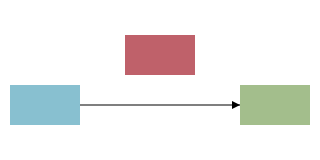

# Connections

_Edges between diagram blocks: source -> destination :kind, generated endpoints, computed edges, routing._

Inside a `diagram`, `source -> destination :kind` draws an edge between two shapes (matched by `id`). The optional `:kind` tag is a symbol; the renderer routes the edge based on the diagram's layout and styles it by kind. Connections are the wiring under every relational diagram — see also [entity diagrams](../references/fact_diagrams.md), [flowcharts](../references/fact_flowcharts.md), [sequence diagrams](../references/fact_sequence_diagrams.md), and [state diagrams](../references/fact_state_diagrams.md).


```wcl
diagram {
  width = 380
  height = 90
  rect {
    id = a
    x = 10.0
    y = 25.0
    width = 70.0
    height = 40.0
    fill = "#88c0d0"
  }
  rect {
    id = b
    x = 150.0
    y = 25.0
    width = 70.0
    height = 40.0
    fill = "#a3be8c"
  }
  rect {
    id = c
    x = 290.0
    y = 25.0
    width = 70.0
    height = 40.0
    fill = "#ebcb8b"
  }
  a -> b :flow
  b -> c :data
}
```


## Syntax

| Form | Meaning |
| --- | --- |
| `a -> b` | Edge from the shape with `id = a` to the shape with `id = b` (kind `:default`). |
| `a -> b :flow` | Same edge, tagged with a `:kind` symbol that styles it. |
| ids | Endpoints are matched by each shape's `id`, including ids generated by a `wdoc_repeater` / `wdoc_component`. An id that matches no shape is dropped with a build warning. |

## Generated endpoints

A diagram's `Edge` connection is declared `@dynamic`, so a `->` endpoint may name an id that a `wdoc_repeater` (or `wdoc_component`) produces at render time, not just a literal shape. This is what lets database / ER and class diagrams be data-driven. Opt a \*custom\* connection schema into the same behaviour with the `@dynamic` decorator; without it, an endpoint that doesn't name a literal block is a `wcl check` error.


```wcl
node_table { id = orders  width = 150.0  title = "orders"
  wdoc_repeater { each = ["id", "user_id"]  as = :c
    node_row { id = $"orders_${c}"  p $"${c}: int" }
  }
}
// `orders_user_id` is generated by the repeater, yet addressable:
users_id -> orders_user_id :data
```

## Edge kinds

| Kind | Use |
| --- | --- |
| `:default` | A plain directed edge (the kind when no tag is given). |
| `:flow` | A process / control-flow edge. |
| `:data` | A data-flow edge. |

## Computed edges, labels and dashes

Besides `->` statements, a diagram (or container) accepts a computed `edges = [...]` field — a list of records with `source` / `destination` (shape ids) and an optional `kind`. The two forms may coexist. Only the record form carries presentation payload: `label` renders as text at the edge's midpoint, and `dash` becomes an inline `stroke-dasharray`.


```wcl
diagram {
  width = 340
  height = 90
  rect {
    id = la
    x = 10.0
    y = 25.0
    width = 90.0
    height = 40.0
    fill = "#88c0d0"
  }
  rect {
    id = lb
    x = 240.0
    y = 25.0
    width = 90.0
    height = 40.0
    fill = "#a3be8c"
  }
  edges = [{ source: "la", destination: "lb", label: "ships to", dash: "5 4" }]
}
```


## Routing

How an edge gets from source to destination is set on the \*diagram\*, not the edge: `routing = :elbow` (default) draws an orthogonal multi-bend polyline that routes around other shapes; `routing = :straight` draws a single direct line. Use `connect_points` on a shape to restrict which sides (`:north`/`:east`/`:south`/`:west`) an edge may attach to.


Elbow routing (the default) bends around an intervening shape:

```wcl
diagram {
  width = 320
  height = 160
  routing = :elbow
  rect {
    id = s
    x = 10.0
    y = 60.0
    width = 70.0
    height = 40.0
    fill = "#88c0d0"
  }
  rect {
    id = o
    x = 125.0
    y = 10.0
    width = 70.0
    height = 40.0
    fill = "#bf616a"
  }
  rect {
    id = d
    x = 240.0
    y = 60.0
    width = 70.0
    height = 40.0
    fill = "#a3be8c"
  }
  s -> d :flow
}
```



## Related

- [Data Views](../references/concept_data_views.md)

[← Back to SKILL.md](../SKILL.md)
