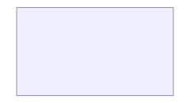

# composite shapes

Composite shapes hold or lay out content rather than drawing a single primitive — a `container` frames child shapes, a `card` embeds rich wdoc content, and a `node_table` builds a row-table with per-row connection ports. Each leads with its own preview.

## container

A `container` frames its children and can lay them out automatically (here a 2-column grid):

```wcl
diagram {
  width = 240
  height = 130
  container {
    anchor_left = 10.0
    anchor_top = 10.0
    fill = "#eef"
    stroke = "#88a"
    padding = 10.0
    layout = :grid
    columns = 2
    cell_width = 90.0
    cell_height = 44.0
    gap = 10.0
    rect {
      fill = "#88c0d0"
    }
    rect {
      fill = "#a3be8c"
    }
    rect {
      fill = "#ebcb8b"
    }
    rect {
      fill = "#b48ead"
    }
  }
}
```



A titled box that groups and frames child shapes.

| Property | Type | Required | Description |
| --- | --- | --- | --- |
| `id` | `identifier` | no | Name used to connect the shape (`a -> b`) and to anchor others to it. |
| `class` | `list<utf8>` | no | Style classes — text and SVG paint via the `class` system. |
| `link` | `utf8` | no | Link the shape to an in-site page (bare page name, or `site:page`). Wraps it in a clickable `<a>`; an unknown page fails the build like a bad prose link. |
| `stroke` | `utf8` | no | Optional chrome — outline colour of the background rect that makes the group visible. |
| `fill` | `utf8` | no | Optional chrome — fill colour of the background rect that makes the group visible. |
| `padding` | `f64` | no | Inset between the chrome and the child shapes. |
| `width` | `f64` | no | Declared interior width (when no layout/anchor sizes it). |
| `height` | `f64` | no | Declared interior height (when no layout/anchor sizes it). |
| `layout` | `symbol` | no | Layout mode: `:free` (default, manual) / `:grid` / `:layered` / `:force` / `:radial`. |
| `columns` | `i64` | no | Number of columns for `:grid` layout. |
| `cell_width` | `f64` | no | Grid cell width for `:grid` layout. |
| `cell_height` | `f64` | no | Grid cell height for `:grid` layout. |
| `gap` | `f64` | no | Gap between cells in `:grid` layout. |
| `direction` | `symbol` | no | Flow direction for `:layered`: `:top_to_bottom` (default) / `:left_to_right`. |
| `layer_gap` | `f64` | no | Spacing between ranks (layers) in `:layered` layout. |
| `node_gap` | `f64` | no | Spacing between nodes within a rank in `:layered` layout. |
| `iterations` | `i64` | no | `:force` relaxation steps (default 300). |
| `repulsion` | `f64` | no | `:force` node repulsion strength (default 9000). |
| `link_distance` | `f64` | no | `:force` ideal edge-to-edge length (default 60). |
| `gravity` | `f64` | no | `:force` centering pull (default 0.05). |
| `seed` | `i64` | no | `:force` random seed for reproducible layouts (default 1). |
| `hub` | `identifier` | no | `:radial` hub shape id (defaults to the highest-degree shape). |
| `radius` | `f64` | no | `:radial` radius of the first ring (default: auto-fit to shape sizes). |
| `ring_gap` | `f64` | no | `:radial` added radius per successive ring (default 120). |
| `start_angle` | `f64` | no | `:radial` angle (radians) of the first shape on each ring (default -PI/2, i.e. top). |
| `anchor_left` | `f64` | no | Fractional anchor (0–1) pinning the left edge to the parent box. |
| `anchor_right` | `f64` | no | Fractional anchor (0–1) pinning the right edge to the parent box. |
| `anchor_top` | `f64` | no | Fractional anchor (0–1) pinning the top edge to the parent box. |
| `anchor_bottom` | `f64` | no | Fractional anchor (0–1) pinning the bottom edge to the parent box. |
| `connect_points` | `list<AnchorSide>` | no | Which sides (`:left`/`:right`/`:top`/`:bottom`) edges attach to. |
| `icon` | `utf8` | no | Icon-badge icon (a `pack.name`). |
| `icon_size` | `f64` | no | Icon-badge size. |
| `icon_pos` | `IconPos` | no | Icon-badge position (`:center` / `:top_left` / …). |
| `icon_class` | `list<utf8>` | no | Icon-badge style classes. |
| `edges` | `list<Edge>` | yes | Edges connecting child shapes (`a -> b`). |

#### Child blocks

| Slot | Accepts | Multiple | Description |
| --- | --- | --- | --- |
| `children` | `SvgBlock` | yes | The child shapes laid out by the container. |

## card

A `card`'s body is rich wdoc content (paragraphs, lists, even nested diagrams), drawn in a `foreignObject`:

```wcl
diagram {
  width = 260
  height = 110
  card {
    x = 20.0
    y = 15.0
    width = 220.0
    height = 80.0
    title = "Note"
    p "Rich **text** inside a diagram."
  }
}
```


A box whose body is rich wdoc content (paragraphs, lists, nested diagrams), drawn in a foreignObject.

| Property | Type | Required | Description |
| --- | --- | --- | --- |
| `x` | `f64` | no | Top-left x placement in the diagram (or use anchors). |
| `y` | `f64` | no | Top-left y placement in the diagram (or use anchors). |
| `width` | `f64` | no | Card box width (default 160). |
| `height` | `f64` | no | Card box height (default 90). |
| `anchor_left` | `f64` | no | Diagram anchor insets (left/right/top/bottom), like any shape. |
| `on` | `utf8` | no | ISO date the card is pinned to (used only when it's a `timeline` child). |
| `side` | `symbol` | no | Timeline side: `:near` / `:far` / `:auto` (used only as a `timeline` child). |
| `title` | `utf8` | no | Optional plain-text heading. |
| `id` | `identifier` | no | Optional explicit HTML id. |
| `class` | `list<utf8>` | no | Optional style classes. |
| `connect_points` | `list<AnchorSide>` | no | Diagram edge-attach sides, like any shape. |

#### Child blocks

| Slot | Accepts | Multiple | Description |
| --- | --- | --- | --- |
| `body` | `WdocBlock` | yes | The card's rich content (paragraphs, lists, callouts, nested diagrams…). |

## node_table

Two `node_table`s joined by a foreign-key edge that targets a single row:

```wcl
diagram {
  width = 420
  height = 170
  routing = :straight
  node_table {
    id = users
    x = 20.0
    y = 20.0
    width = 150.0
    title = "users"
    node_row {
      id = users_id
      p "id: int"
    }
    node_row {
      id = users_email
      p "email: text"
    }
  }
  node_table {
    id = orders
    x = 250.0
    y = 20.0
    width = 150.0
    title = "orders"
    node_row {
      id = orders_id
      p "id: int"
    }
    node_row {
      id = orders_user_id
      p "user_id: int"
    }
  }
  orders_user_id -> users_id :data
}
```


A row-table shape for DB / class diagrams, with per-row connection ports.

| Property | Type | Required | Description |
| --- | --- | --- | --- |
| `x` | `f64` | no | Top-left x placement in the diagram (or use anchors). |
| `y` | `f64` | no | Top-left y placement in the diagram (or use anchors). |
| `width` | `f64` | no | Table width (default 200). Height is derived from the rows. |
| `anchor_left` | `f64` | no | Diagram anchor insets (left/right/top/bottom), like any shape. |
| `title` | `utf8` | no | Optional header title (table / class name). Omit for a header-less table. |
| `header_height` | `f64` | no | Header row height when a `title` is set (default 28). |
| `row_height` | `f64` | no | Fixed height of every row (default 30). The renderer can't measure HTML, so rows don't auto-size. |
| `id` | `identifier` | no | Optional explicit HTML id (edge target for the whole table). |
| `class` | `list<utf8>` | no | Optional style classes (applied to the frame). |
| `connect_points` | `list<AnchorSide>` | no | Whole-table edge-attach sides (default all four). Per-row sides come from each `node_row`. |

#### Child blocks

| Slot | Accepts | Multiple | Description |
| --- | --- | --- | --- |
| `rows` | `node_row` | yes | The table rows, top to bottom. |

One row of a node_table.

| Property | Type | Required | Description |
| --- | --- | --- | --- |
| `id` | `identifier` | no | Row id — the edge target for connecting to this row (`fk -> users_id`). |
| `class` | `list<utf8>` | no | Optional style classes (applied to the row content). |
| `connect_points` | `list<AnchorSide>` | no | Sides this row exposes a connection point + marker on (default `[:west, :east]`). |

#### Child blocks

| Slot | Accepts | Multiple | Description |
| --- | --- | --- | --- |
| `body` | `WdocBlock` | yes | The row's rich content (paragraphs, code, lists…). |

## Related

- [diagram](../references/fact_diagrams.md)

- [primitive shapes](../references/fact_primitive_shapes.md)

- [Connections](../references/concept_connections.md)

[← Back to SKILL.md](../SKILL.md)
