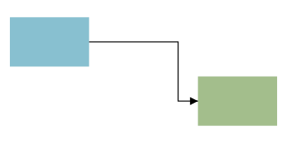

# diagram

A `diagram` is wdoc's drawing surface. It declares a `width` / `height` and holds shapes that break down into primitives and render as SVG. Connect two shapes by id with an `a -> b` edge; set `pan_zoom = true` for an interactive viewport; set a `layout` (`:layered` / `:radial` / `:force`) to place shapes automatically (see [layout modes](../references/fact_layout_modes.md)). Higher-level families (flowcharts, charts, trees, maps, tilemaps, wireframes) are shapes that live inside a `diagram` too. The primitive shapes are catalogued below; see also the [connections](../references/concept_connections.md) concept.

```wcl
diagram {
  width = 320
  height = 160
  pan_zoom = true
  zoom_min = 0.5
  zoom_max = 4.0
  rect {
    id = a
    x = 20.0
    y = 30.0
    width = 80.0
    height = 50.0
    fill = "#88c0d0"
  }
  rect {
    id = b
    x = 210.0
    y = 90.0
    width = 80.0
    height = 50.0
    fill = "#a3be8c"
  }
  a -> b
}
```



| Property | Type | Required | Description |
| --- | --- | --- | --- |
| `width` | `i64` | yes | Diagram canvas width in pixels. |
| `height` | `i64` | yes | Diagram canvas height in pixels. |
| `id` | `identifier` | no | Optional explicit HTML id. |
| `class` | `list<utf8>` | no | Optional style classes. |
| `layout` | `symbol` | no | Layout mode: `:free` (default, manual x/y) / `:grid` / `:layered` / `:force` / `:radial`. |
| `direction` | `symbol` | no | Flow direction for `:layered`: `:top_to_bottom` (default) / `:left_to_right`. |
| `layer_gap` | `f64` | no | Spacing between ranks (layers) in `:layered` layout. |
| `node_gap` | `f64` | no | Spacing between nodes within a rank in `:layered` layout. |
| `cell_width` | `f64` | no | Grid cell width for `:grid` layout. |
| `cell_height` | `f64` | no | Grid cell height for `:grid` layout. |
| `columns` | `i64` | no | Number of columns for `:grid` layout. |
| `gap` | `f64` | no | Gap between cells in `:grid` layout. |
| `iterations` | `i64` | no | `:force` relaxation steps (default 300). |
| `repulsion` | `f64` | no | `:force` node repulsion strength (default 9000). |
| `link_distance` | `f64` | no | `:force` ideal edge-to-edge length (default 60). |
| `gravity` | `f64` | no | `:force` centering pull (default 0.05). |
| `seed` | `i64` | no | `:force` random seed for reproducible layouts (default 1). |
| `hub` | `identifier` | no | `:radial` hub shape id (defaults to the highest-degree shape). |
| `radius` | `f64` | no | `:radial` radius of the first ring (default: auto-fit to shape sizes). |
| `ring_gap` | `f64` | no | `:radial` added radius per successive ring (default 120). |
| `start_angle` | `f64` | no | `:radial` angle (radians) of the first shape on each ring (default -PI/2, i.e. top). |
| `routing` | `symbol` | no | Edge routing: `:elbow` (default) / `:straight`. |
| `edge_separation` | `f64` | no | Nudge step that separates parallel edges (default 4). |
| `pan_zoom` | `bool` | no | When `true`, wrap in an interactive viewport with wheel-zoom, drag-pan, and `+`/`−`/`⟲` controls. |
| `zoom_min` | `f64` | no | Minimum zoom scale; `1.0` = fitted view (default 1.0). |
| `zoom_max` | `f64` | no | Maximum zoom scale (default 4.0). |
| `pan_margin` | `f64` | no | Extra overscroll past the content bounds, in px (default 0). |
| `desc` | `utf8` | no | Accessible description: becomes the SVG's `<title>` and `aria-label`, so screen readers can announce the diagram. |
| `edges` | `list<Edge>` | yes | Edges connecting shapes (`a -> b`). |

#### Child blocks

| Slot | Accepts | Multiple | Description |
| --- | --- | --- | --- |
| `children` | `SvgBlock` | yes | The shapes drawn in the diagram. |

## Shapes

A diagram holds shapes that break down into primitives. They split across three pages:

- [Primitive shapes](../references/fact_primitive_shapes.md) — `rect`, `circle`, `line`, `label`, `polygon`: the base figures everything else lowers to.
- [Composite shapes](../references/fact_composite_shapes.md) — `container`, `card`, `node_table`: shapes that hold or lay out content.
- [Styling shapes with classes](../references/fact_shape_styling.md) — paint shapes with theme-aware `class`es instead of baked-in `fill`s.

Higher-level families (flowcharts, charts, trees, maps, tilemaps, wireframes) are shapes that live inside a `diagram` too; wiring is covered by the [connections](../references/concept_connections.md) concept and placement by the [layout modes](../references/fact_layout_modes.md).

## Related

- [flowchart shapes](../references/fact_flowcharts.md)

- [sequence_diagram](../references/fact_sequence_diagrams.md)

- [state_diagram](../references/fact_state_diagrams.md)

- [charts](../references/fact_charts.md)

- [tree](../references/fact_tree.md)

- [image](../references/fact_images.md)

- [iconset / icon_def / icon](../references/fact_icons.md)

[← Back to SKILL.md](../SKILL.md)
