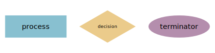
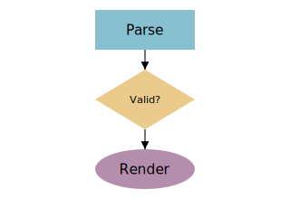
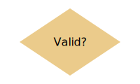
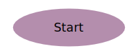
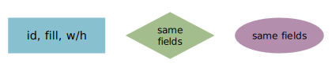

# flowchart shapes

Flowchart shapes plus the layered auto-layout mode turn a `diagram` into a flowchart: declare the shapes and the edges, and the renderer ranks them topologically and elbow-routes the connections. The three stdlib shapes lower to SVG primitives and take the same fields, differing only in the figure drawn: `process` is a rectangle (an action/step), `decision` a diamond (a yes/no branch), and `terminator` an oval (a start/end node). See [connections](../references/concept_connections.md).

The three shapes side by side — `process` (rectangle), `decision` (diamond), `terminator` (oval):

```wcl
diagram {
  width = 440
  height = 110
  process "process" {
    id = gp
    x = 20.0
    y = 35.0
    width = 120.0
    height = 44.0
    fill = "#88c0d0"
  }
  decision "decision" {
    id = gd
    x = 165.0
    y = 25.0
    width = 110.0
    height = 64.0
    fill = "#ebcb8b"
  }
  terminator "terminator" {
    id = gt
    x = 300.0
    y = 35.0
    width = 120.0
    height = 44.0
    fill = "#b48ead"
  }
}
```



Wired into a flow with `:layered` auto-layout:

```wcl
diagram {
  width = 320
  height = 220
  layout = :layered
  layer_gap = 20.0

  process "Parse" {
    id = parse
    width = 100.0
    height = 40.0
    fill = "#88c0d0"
  }
  decision "Valid?" {
    id = valid
    width = 100.0
    height = 60.0
    fill = "#ebcb8b"
  }
  terminator "Render" {
    id = render
    width = 100.0
    height = 40.0
    fill = "#b48ead"
  }

  parse -> valid :flow
  valid -> render :flow
}
```



### process

A rectangle — an action or step in the flow:

```wcl
diagram {
  width = 200
  height = 80
  process "Render page" {
    x = 30.0
    y = 20.0
    width = 140.0
    height = 40.0
    fill = "#88c0d0"
  }
}
```


| Property | Type | Required | Description |
| --- | --- | --- | --- |
| `text` | `utf8` | yes | The shape's label (centred plain text). |
| `x` | `f64` | no | Top-left x placement. Omit under `layout = :layered` — the layout decides. |
| `y` | `f64` | no | Top-left y placement. Omit under `layout = :layered` — the layout decides. |
| `width` | `f64` | no | Box width. |
| `height` | `f64` | no | Box height. |
| `fill` | `utf8` | no | Fill colour (defaults to a theme class if unset). |
| `stroke` | `utf8` | no | Outline colour. |
| `id` | `identifier` | no | Name used to connect the shape (`a -> b`). |
| `class` | `list<utf8>` | no | Style classes — SVG paint via the `class` system. |
| `connect_points` | `list<AnchorSide>` | no | Which sides (`:left`/`:right`/`:top`/`:bottom`) edges attach to. |
| `icon` | `utf8` | no | Icon-badge icon (a `pack.name`). |
| `icon_size` | `f64` | no | Icon-badge size. |
| `icon_pos` | `IconPos` | no | Icon-badge position (`:center` / `:top_left` / …). |
| `icon_class` | `list<utf8>` | no | Icon-badge style classes. |
| `link` | `utf8` | no | Link the shape to an in-site page (bare page name, or `site:page`). Wraps it in a clickable `<a>`; an unknown page fails the build like a bad prose link. |

### decision

A diamond — a yes/no branch point:

```wcl
diagram {
  width = 200
  height = 120
  decision "Valid?" {
    x = 40.0
    y = 20.0
    width = 120.0
    height = 80.0
    fill = "#ebcb8b"
  }
}
```



A diamond node — a yes/no branch point.

| Property | Type | Required | Description |
| --- | --- | --- | --- |
| `text` | `utf8` | yes | The shape's label (centred plain text). |
| `x` | `f64` | no | Top-left x placement. Omit under `layout = :layered` — the layout decides. |
| `y` | `f64` | no | Top-left y placement. Omit under `layout = :layered` — the layout decides. |
| `width` | `f64` | no | Box width. |
| `height` | `f64` | no | Box height. |
| `fill` | `utf8` | no | Fill colour (defaults to a theme class if unset). |
| `stroke` | `utf8` | no | Outline colour. |
| `id` | `identifier` | no | Name used to connect the shape (`a -> b`). |
| `class` | `list<utf8>` | no | Style classes — SVG paint via the `class` system. |
| `connect_points` | `list<AnchorSide>` | no | Which sides (`:left`/`:right`/`:top`/`:bottom`) edges attach to. |
| `icon` | `utf8` | no | Icon-badge icon (a `pack.name`). |
| `icon_size` | `f64` | no | Icon-badge size. |
| `icon_pos` | `IconPos` | no | Icon-badge position (`:center` / `:top_left` / …). |
| `icon_class` | `list<utf8>` | no | Icon-badge style classes. |
| `link` | `utf8` | no | Link the shape to an in-site page (bare page name, or `site:page`). Wraps it in a clickable `<a>`; an unknown page fails the build like a bad prose link. |

### terminator

An oval — a start or end point of the flow:

```wcl
diagram {
  width = 200
  height = 80
  terminator "Start" {
    x = 35.0
    y = 20.0
    width = 130.0
    height = 44.0
    fill = "#b48ead"
  }
}
```



An oval node — a start or end point of the flow.

| Property | Type | Required | Description |
| --- | --- | --- | --- |
| `text` | `utf8` | yes | The shape's label (centred plain text). |
| `x` | `f64` | no | Top-left x placement. Omit under `layout = :layered` — the layout decides. |
| `y` | `f64` | no | Top-left y placement. Omit under `layout = :layered` — the layout decides. |
| `width` | `f64` | no | Box width. |
| `height` | `f64` | no | Box height. |
| `fill` | `utf8` | no | Fill colour (defaults to a theme class if unset). |
| `stroke` | `utf8` | no | Outline colour. |
| `id` | `identifier` | no | Name used to connect the shape (`a -> b`). |
| `class` | `list<utf8>` | no | Style classes — SVG paint via the `class` system. |
| `connect_points` | `list<AnchorSide>` | no | Which sides (`:left`/`:right`/`:top`/`:bottom`) edges attach to. |
| `icon` | `utf8` | no | Icon-badge icon (a `pack.name`). |
| `icon_size` | `f64` | no | Icon-badge size. |
| `icon_pos` | `IconPos` | no | Icon-badge position (`:center` / `:top_left` / …). |
| `icon_class` | `list<utf8>` | no | Icon-badge style classes. |
| `link` | `utf8` | no | Link the shape to an in-site page (bare page name, or `site:page`). Wraps it in a clickable `<a>`; an unknown page fails the build like a bad prose link. |

### GraphNode (shared base)

`process` / `decision` / `terminator` all extend `GraphNode`, so they share the same fields (`id`, `width`, `height`, `fill`, …) — only the figure drawn differs, as the demo below shows three nodes built with identical fields:

```wcl
diagram {
  width = 420
  height = 90
  process "id, fill, w/h" {
    x = 20.0
    y = 25.0
    width = 120.0
    height = 44.0
    fill = "#88c0d0"
  }
  decision "same fields" {
    x = 165.0
    y = 18.0
    width = 110.0
    height = 58.0
    fill = "#a3be8c"
  }
  terminator "same fields" {
    x = 300.0
    y = 25.0
    width = 110.0
    height = 44.0
    fill = "#b48ead"
  }
}
```



The shared base of the flowchart shapes — the fields (`id`, `width`, `height`, `fill`, …) every figure takes.

| Property | Type | Required | Description |
| --- | --- | --- | --- |
| `text` | `utf8` | yes | The node's label (centred plain text). |
| `x` | `f64` | no | Top-left x placement. Omit under an auto-layout — the layout decides. |
| `y` | `f64` | no | Top-left y placement. Omit under an auto-layout — the layout decides. |
| `width` | `f64` | no | Box width (the circle is inscribed in this box). |
| `height` | `f64` | no | Box height (the circle is inscribed in this box). |
| `fill` | `utf8` | no | Fill colour (defaults to a theme class if unset). |
| `stroke` | `utf8` | no | Outline colour. |
| `id` | `identifier` | no | Name used to connect the node (`a -> b`). |
| `class` | `list<utf8>` | no | Style classes — SVG paint via the `class` system. |
| `connect_points` | `list<AnchorSide>` | no | Which sides (`:left`/`:right`/`:top`/`:bottom`) edges attach to. |
| `icon` | `utf8` | no | Icon-badge icon (a `pack.name`). |
| `icon_size` | `f64` | no | Icon-badge size. |
| `icon_pos` | `IconPos` | no | Icon-badge position (`:center` / `:top_left` / …). |
| `icon_class` | `list<utf8>` | no | Icon-badge style classes. |
| `link` | `utf8` | no | Link the shape to an in-site page (bare page name, or `site:page`). Wraps it in a clickable `<a>`; an unknown page fails the build like a bad prose link. |

## Layered auto-layout

Set `layout = :layered` on the diagram. Shapes are topologically ranked from the connection graph and stacked top-to-bottom; elbow routing then connects them with right-angled paths, and `layer_gap` controls the spacing between ranks.

## Radial layout and boundaries

Set `layout = :radial` for an "X and everything it talks to" shape: one `hub` shape sits at the centre and the rest ring around it (pairs well with `routing = :straight`). A `boundary` draws a labelled box behind a set of shapes named in `members` — it owns no layout, so it works on `:radial` and `:force` where a `container` cannot.

```wcl
diagram {
  width = 360
  height = 300
  layout = :radial
  hub = platform
  routing = :straight

  process "Platform" {
    id = platform
    width = 96.0
    height = 44.0
  }
  process "Warehouse" {
    id = warehouse
    width = 96.0
    height = 44.0
  }
  process "Billing" {
    id = billing
    width = 96.0
    height = 44.0
  }

  platform -> warehouse :flow
  platform -> billing :flow

  boundary "Achmisoft" {
    members = [platform, warehouse, billing]
  }
}
```


## Examples

### A layered flowchart

Declare the shapes and the edges, then set layout = :layered — the renderer ranks the shapes topologically and elbow-routes the connections.

```wcl
diagram {
  width = 320  height = 220  layout = :layered  layer_gap = 20.0

  process    "Parse"  { id = parse   width = 100.0  height = 40.0  fill = "#88c0d0" }
  decision   "Valid?" { id = valid   width = 100.0  height = 60.0  fill = "#ebcb8b" }
  terminator "Render" { id = render  width = 100.0  height = 40.0  fill = "#b48ead" }

  parse -> valid  :flow
  valid -> render :flow
}
```

**Expected:** Three shapes stacked top-to-bottom in connection order, joined by right-angled arrows.

## Related

- [diagram](../references/fact_diagrams.md)

- [sequence_diagram](../references/fact_sequence_diagrams.md)

- [state_diagram](../references/fact_state_diagrams.md)

[← Back to SKILL.md](../SKILL.md)
