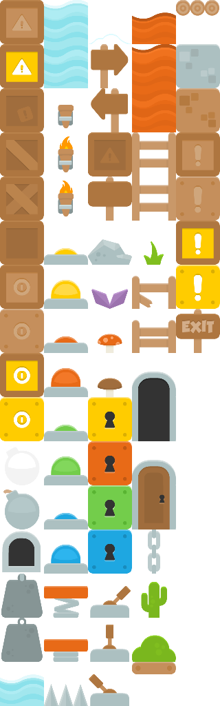

# image

`image` embeds a static image. The source path resolves relative to the build entry file and the file is copied verbatim into `_wdoc/` at build time, so the output site is self-contained. Because it's referenced by a relative `_wdoc/` URL, it only resolves when the site is served — not when the page is opened directly from disk (same as icons and tilemaps).

| Property | Type | Required | Description |
| --- | --- | --- | --- |
| `source` | `utf8` | yes | Image source (the inline label): a doc-relative path, a URL, or a `data:` URI. |
| `alt` | `utf8` | no | Alt text for the `` (page form). |
| `width` | `f64` | no | Display width; the natural size is used when omitted. |
| `height` | `f64` | no | Display height; the natural size is used when omitted. |
| `id` | `identifier` | no | Optional explicit HTML id. |
| `class` | `list<utf8>` | no | Optional style classes. |
| `x` | `f64` | no | Placement x when used inside a diagram (ignored on a page). |
| `y` | `f64` | no | Placement y when used inside a diagram (ignored on a page). |
| `scale` | `f64` | no | Extra size multiplier (diagram form). |
| `anchor_left` | `f64` | no | Diagram anchor insets (left/right/top/bottom), like any shape. |
| `connect_points` | `list<AnchorSide>` | no | Diagram edge-attach sides, like any shape. |

## On a page

An `image` block directly under a `page` renders as a standalone ``. The source is the inline label; set `width` / `height` to size it, `alt` for accessibility, and a `class` for styling (live below — a Kenney CC0 spritesheet, scaled down):

```wcl
image "../../assets/kenney-platformer.png" {
  alt = "A platformer tile sheet"
  width = 240.0
}
```



## Inside a diagram

`image` is also a placeable `SvgBlock`, so it can sit in a `diagram` / `container` alongside `rect` / `circle`, positioned by `x` / `y` (or anchors).

```wcl
diagram {
  width = 280
  height = 140
  image "../../assets/kenney-platformer.png" {
    x = 20.0
    y = 20.0
    width = 100.0
    height = 100.0
  }
  rect {
    x = 150.0
    y = 45.0
    width = 100.0
    height = 50.0
    fill = "#a3be8c"
  }
}
```


## Related

- [diagram](../references/fact_diagrams.md)

- [video](../references/fact_videos.md)

- [map](../references/fact_maps.md)

[← Back to SKILL.md](../SKILL.md)
