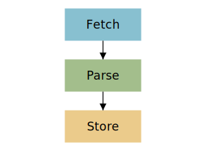
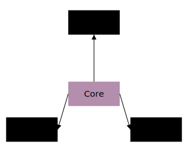
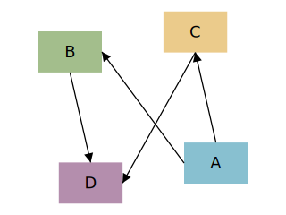

# Diagram and container layout modes

A `diagram` (or a `container`) places its shapes with one of several layout modes, set by `layout = :<mode>`. The default is free placement from explicit coordinates; the auto-layout modes derive positions from the connection graph instead.

| Mode | Behaviour |
| --- | --- |
| :free | Default — shapes sit at the explicit `x`/`y` coordinates you give them |
| :grid | Shapes flow into rows and columns of a regular grid |
| :layered | Shapes are topologically ranked from the edges and stacked top-to-bottom, elbow-routed (flowcharts) |
| :force | A force-directed solver spreads connected shapes apart and pulls neighbours together |
| :radial | One hub sits at the centre with every other shape on a ring around it (hub-and-spoke) |

## The auto-layout modes in action

Each derives positions from the same shapes + edges — only `layout` changes.

### :grid

Children flow into a regular grid (here on a `container`, which also takes the grid sizing fields):

```wcl
diagram {
  width = 240
  height = 140
  container {
    anchor_left = 8.0
    anchor_top = 8.0
    fill = "#eef"
    stroke = "#88a"
    padding = 10.0
    layout = :grid
    columns = 3
    cell_width = 56.0
    cell_height = 40.0
    gap = 10.0
    rect {
      fill = "#88c0d0"
    }
    rect {
      fill = "#a3be8c"
    }
    rect {
      fill = "#ebcb8b"
    }
    rect {
      fill = "#b48ead"
    }
    rect {
      fill = "#bf616a"
    }
    rect {
      fill = "#d08770"
    }
  }
}
```


### :layered

Shapes are topologically ranked from the edges and stacked top-to-bottom, elbow-routed:

```wcl
diagram {
  width = 300
  height = 220
  layout = :layered
  layer_gap = 22.0
  process "Fetch" {
    id = fetch
    width = 90.0
    height = 38.0
    fill = "#88c0d0"
  }
  process "Parse" {
    id = parse
    width = 90.0
    height = 38.0
    fill = "#a3be8c"
  }
  process "Store" {
    id = store
    width = 90.0
    height = 38.0
    fill = "#ebcb8b"
  }
  fetch -> parse :flow
  parse -> store :flow
}
```



### :radial

One `hub` sits at the centre with the rest ringed around it (pairs well with `routing = :straight`):

```wcl
diagram {
  width = 320
  height = 260
  layout = :radial
  hub = core
  routing = :straight
  process "Core" {
    id = core
    width = 84.0
    height = 40.0
    fill = "#b48ead"
  }
  process "Auth" {
    id = auth
    width = 84.0
    height = 40.0
  }
  process "Cache" {
    id = cache
    width = 84.0
    height = 40.0
  }
  process "Queue" {
    id = queue
    width = 84.0
    height = 40.0
  }
  core -> auth :flow
  core -> cache :flow
  core -> queue :flow
}
```



### :force

A force-directed solver spreads connected shapes apart and pulls neighbours together:

```wcl
diagram {
  width = 320
  height = 240
  layout = :force
  routing = :straight
  process "A" {
    id = na
    width = 56.0
    height = 36.0
    fill = "#88c0d0"
  }
  process "B" {
    id = nb
    width = 56.0
    height = 36.0
    fill = "#a3be8c"
  }
  process "C" {
    id = nc
    width = 56.0
    height = 36.0
    fill = "#ebcb8b"
  }
  process "D" {
    id = nd
    width = 56.0
    height = 36.0
    fill = "#b48ead"
  }
  na -> nb
  na -> nc
  nb -> nd
  nc -> nd
}
```



## Related

- [diagram](../references/fact_diagrams.md)

- [flowchart shapes](../references/fact_flowcharts.md)

- [Connections](../references/concept_connections.md)

[← Back to SKILL.md](../SKILL.md)
