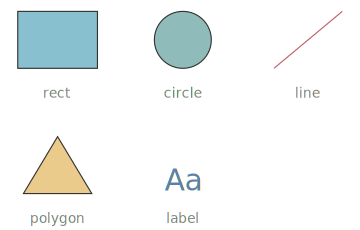

# primitive shapes

The base shapes a `diagram` is built from — everything else (flowchart nodes, cards, trees) lowers to these. They live inside a `diagram` and are placed by `x` / `y` (or anchors). The five simplest, side by side:

```wcl
diagram {
  width = 360
  height = 230
  rect {
    x = 35.0
    y = 30.0
    width = 70.0
    height = 50.0
    fill = "#88c0d0"
    stroke = "#333"
  }
  circle {
    cx = 180.0
    cy = 55.0
    r = 25.0
    fill = "#8fbcbb"
    stroke = "#333"
  }
  line {
    x1 = 260.0
    y1 = 80.0
    x2 = 320.0
    y2 = 30.0
    stroke = "#bf616a"
  }
  label "rect" {
    x = 70.0
    y = 102.0
    font_size = 12.0
    fill = "#888"
  }
  label "circle" {
    x = 180.0
    y = 102.0
    font_size = 12.0
    fill = "#888"
  }
  label "line" {
    x = 290.0
    y = 102.0
    font_size = 12.0
    fill = "#888"
  }
  polygon {
    points = "40,190 70,140 100,190"
    fill = "#ebcb8b"
    stroke = "#333"
  }
  label "Aa" {
    x = 180.0
    y = 178.0
    font_size = 26.0
    fill = "#5e81ac"
  }
  label "polygon" {
    x = 70.0
    y = 212.0
    font_size = 12.0
    fill = "#888"
  }
  label "label" {
    x = 180.0
    y = 212.0
    font_size = 12.0
    fill = "#888"
  }
}
```



An axis-aligned rectangle — the workhorse box.

| Property | Type | Required | Description |
| --- | --- | --- | --- |
| `x` | `f64` | no | Top-left x corner, in canvas pixels. |
| `y` | `f64` | no | Top-left y corner, in canvas pixels. |
| `width` | `f64` | no | Box width. |
| `height` | `f64` | no | Box height. |
| `fill` | `utf8` | no | Fill colour. |
| `stroke` | `utf8` | no | Outline colour. |
| `id` | `identifier` | no | Name used to connect the shape (`a -> b`) and to anchor others to it. |
| `class` | `list<utf8>` | no | Style classes — text and SVG paint via the `class` system. |
| `anchor_left` | `f64` | no | Fractional anchor (0–1) pinning the left edge to the parent box. |
| `anchor_right` | `f64` | no | Fractional anchor (0–1) pinning the right edge to the parent box. |
| `anchor_top` | `f64` | no | Fractional anchor (0–1) pinning the top edge to the parent box. |
| `anchor_bottom` | `f64` | no | Fractional anchor (0–1) pinning the bottom edge to the parent box. |
| `connect_points` | `list<AnchorSide>` | no | Which sides (`:left`/`:right`/`:top`/`:bottom`) edges attach to. |
| `icon` | `utf8` | no | Icon-badge icon (a `pack.name`). |
| `icon_size` | `f64` | no | Icon-badge size. |
| `icon_pos` | `IconPos` | no | Icon-badge position (`:center` / `:top_left` / …). |
| `icon_class` | `list<utf8>` | no | Icon-badge style classes. |
| `link` | `utf8` | no | Link the shape to an in-site page (bare page name, or `site:page`). Wraps it in a clickable `<a>`; an unknown page fails the build like a bad prose link. |

A circle placed by its centre and radius.

| Property | Type | Required | Description |
| --- | --- | --- | --- |
| `cx` | `f64` | no | Centre x point. |
| `cy` | `f64` | no | Centre y point. |
| `r` | `f64` | no | Radius. |
| `fill` | `utf8` | no | Fill colour. |
| `stroke` | `utf8` | no | Outline colour. |
| `id` | `identifier` | no | Name used to connect the shape (`a -> b`) and to anchor others to it. |
| `class` | `list<utf8>` | no | Style classes — text and SVG paint via the `class` system. |
| `anchor_left` | `f64` | no | Fractional anchor (0–1) pinning the left edge to the parent box. |
| `anchor_right` | `f64` | no | Fractional anchor (0–1) pinning the right edge to the parent box. |
| `anchor_top` | `f64` | no | Fractional anchor (0–1) pinning the top edge to the parent box. |
| `anchor_bottom` | `f64` | no | Fractional anchor (0–1) pinning the bottom edge to the parent box. |
| `connect_points` | `list<AnchorSide>` | no | Which sides (`:left`/`:right`/`:top`/`:bottom`) edges attach to. |
| `icon` | `utf8` | no | Icon-badge icon (a `pack.name`). |
| `icon_size` | `f64` | no | Icon-badge size. |
| `icon_pos` | `IconPos` | no | Icon-badge position (`:center` / `:top_left` / …). |
| `icon_class` | `list<utf8>` | no | Icon-badge style classes. |
| `link` | `utf8` | no | Link the shape to an in-site page (bare page name, or `site:page`). Wraps it in a clickable `<a>`; an unknown page fails the build like a bad prose link. |

A straight segment between two points.

| Property | Type | Required | Description |
| --- | --- | --- | --- |
| `x1` | `f64` | no | Start-point x. |
| `y1` | `f64` | no | Start-point y. |
| `x2` | `f64` | no | End-point x. |
| `y2` | `f64` | no | End-point y. |
| `stroke` | `utf8` | no | Line colour. |
| `id` | `identifier` | no | Name used to connect the shape (`a -> b`) and to anchor others to it. |
| `class` | `list<utf8>` | no | Style classes — text and SVG paint via the `class` system. |
| `anchor_left` | `f64` | no | Fractional anchor (0–1) pinning the left edge to the parent box. |
| `anchor_right` | `f64` | no | Fractional anchor (0–1) pinning the right edge to the parent box. |
| `anchor_top` | `f64` | no | Fractional anchor (0–1) pinning the top edge to the parent box. |
| `anchor_bottom` | `f64` | no | Fractional anchor (0–1) pinning the bottom edge to the parent box. |
| `connect_points` | `list<AnchorSide>` | no | Which sides (`:left`/`:right`/`:top`/`:bottom`) edges attach to. |
| `link` | `utf8` | no | Link the shape to an in-site page (bare page name, or `site:page`). Wraps it in a clickable `<a>`; an unknown page fails the build like a bad prose link. |

A free-floating text label.

| Property | Type | Required | Description |
| --- | --- | --- | --- |
| `content` | `utf8` | yes | The text, given as the inline label: `label "halfway" { … }`. |
| `x` | `f64` | no | Anchor x position. |
| `y` | `f64` | no | Anchor y position. |
| `font_size` | `f64` | no | Explicit font size; when omitted the text auto-fits its region. |
| `fit_width` | `f64` | no | Width of the region the text is auto-sized to fit (when `font_size` is unset). |
| `fit_height` | `f64` | no | Height of the region the text is auto-sized to fit (when `font_size` is unset). |
| `fill` | `utf8` | no | Text colour. |
| `id` | `identifier` | no | Name used to connect the shape (`a -> b`) and to anchor others to it. |
| `class` | `list<utf8>` | no | Style classes — text and SVG paint via the `class` system. |
| `anchor_left` | `f64` | no | Fractional anchor (0–1) pinning the left edge to the parent box. |
| `anchor_right` | `f64` | no | Fractional anchor (0–1) pinning the right edge to the parent box. |
| `anchor_top` | `f64` | no | Fractional anchor (0–1) pinning the top edge to the parent box. |
| `anchor_bottom` | `f64` | no | Fractional anchor (0–1) pinning the bottom edge to the parent box. |
| `connect_points` | `list<AnchorSide>` | no | Which sides (`:left`/`:right`/`:top`/`:bottom`) edges attach to. |
| `link` | `utf8` | no | Link the shape to an in-site page (bare page name, or `site:page`). Wraps it in a clickable `<a>`; an unknown page fails the build like a bad prose link. |

An arbitrary closed shape from a point list.

| Property | Type | Required | Description |
| --- | --- | --- | --- |
| `points` | `utf8` | yes | Space-separated `x,y` pairs, e.g. `"180,10 230,40 180,70"`. |
| `fill` | `utf8` | no | Fill colour. |
| `stroke` | `utf8` | no | Outline colour. |
| `id` | `identifier` | no | Name used to connect the shape (`a -> b`) and to anchor others to it. |
| `class` | `list<utf8>` | no | Style classes — text and SVG paint via the `class` system. |
| `anchor_left` | `f64` | no | Fractional anchor (0–1) pinning the left edge to the parent box. |
| `anchor_right` | `f64` | no | Fractional anchor (0–1) pinning the right edge to the parent box. |
| `anchor_top` | `f64` | no | Fractional anchor (0–1) pinning the top edge to the parent box. |
| `anchor_bottom` | `f64` | no | Fractional anchor (0–1) pinning the bottom edge to the parent box. |
| `connect_points` | `list<AnchorSide>` | no | Which sides (`:left`/`:right`/`:top`/`:bottom`) edges attach to. |
| `link` | `utf8` | no | Link the shape to an in-site page (bare page name, or `site:page`). Wraps it in a clickable `<a>`; an unknown page fails the build like a bad prose link. |

Composite shapes — `container`, `card`, `node_table` — get their own page; see [composite shapes](../references/fact_composite_shapes.md). Paint them with the [class system](../references/fact_shape_styling.md).

## Related

- [diagram](../references/fact_diagrams.md)

- [styling shapes with classes](../references/fact_shape_styling.md)

- [Connections](../references/concept_connections.md)

[← Back to SKILL.md](../SKILL.md)
