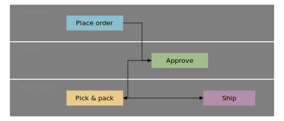
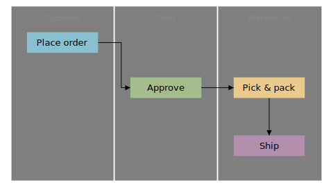

# swim-lane flowcharts

wdoc has no dedicated swim-lane block — you **compose** one from primitives already in the diagram toolkit: draw each lane as a translucent `rect` band with a `label`, place `process` / `decision` nodes inside their lane by `x` / `y`, and wire them with `:flow` edges that cross between lanes. Use a translucent grey fill (e.g. `"#7f7f7f1a"`) so the bands read on both light and dark themes.

## Horizontal lanes (flow left → right)

Lanes are full-width bands stacked top-to-bottom; the process flows across them:

```wcl
diagram {
  width = 560
  height = 240
  routing = :elbow
  rect {
    x = 0.0
    y = 0.0
    width = 560.0
    height = 78.0
    fill = "#7f7f7f14"
  }
  rect {
    x = 0.0
    y = 80.0
    width = 560.0
    height = 78.0
    fill = "#7f7f7f2e"
  }
  rect {
    x = 0.0
    y = 160.0
    width = 560.0
    height = 78.0
    fill = "#7f7f7f14"
  }
  label "Customer" {
    x = 52.0
    y = 16.0
    font_size = 12.0
    fill = "#888"
  }
  label "Sales" {
    x = 42.0
    y = 96.0
    font_size = 12.0
    fill = "#888"
  }
  label "Warehouse" {
    x = 58.0
    y = 176.0
    font_size = 12.0
    fill = "#888"
  }
  process "Place order" {
    id = order
    x = 120.0
    y = 23.0
    width = 120.0
    height = 32.0
    fill = "#88c0d0"
  }
  process "Approve" {
    id = appr
    x = 300.0
    y = 103.0
    width = 120.0
    height = 32.0
    fill = "#a3be8c"
  }
  process "Pick & pack" {
    id = pick
    x = 120.0
    y = 183.0
    width = 120.0
    height = 32.0
    fill = "#ebcb8b"
  }
  process "Ship" {
    id = ship
    x = 410.0
    y = 183.0
    width = 110.0
    height = 32.0
    fill = "#b48ead"
  }
  order -> appr :flow
  appr -> pick :flow
  pick -> ship :flow
}
```



## Vertical lanes (flow top → bottom)

The same idea rotated 90°: lanes are columns and the flow runs downward. Swap the band rectangles to full-height columns and place nodes by lane column:

```wcl
diagram {
  width = 480
  height = 270
  routing = :elbow
  rect {
    x = 0.0
    y = 0.0
    width = 158.0
    height = 270.0
    fill = "#7f7f7f14"
  }
  rect {
    x = 160.0
    y = 0.0
    width = 158.0
    height = 270.0
    fill = "#7f7f7f2e"
  }
  rect {
    x = 320.0
    y = 0.0
    width = 160.0
    height = 270.0
    fill = "#7f7f7f14"
  }
  label "Customer" {
    x = 79.0
    y = 18.0
    font_size = 12.0
    fill = "#888"
  }
  label "Sales" {
    x = 239.0
    y = 18.0
    font_size = 12.0
    fill = "#888"
  }
  label "Warehouse" {
    x = 400.0
    y = 18.0
    font_size = 12.0
    fill = "#888"
  }
  process "Place order" {
    id = vorder
    x = 24.0
    y = 40.0
    width = 110.0
    height = 32.0
    fill = "#88c0d0"
  }
  process "Approve" {
    id = vappr
    x = 184.0
    y = 110.0
    width = 110.0
    height = 32.0
    fill = "#a3be8c"
  }
  process "Pick & pack" {
    id = vpick
    x = 344.0
    y = 110.0
    width = 110.0
    height = 32.0
    fill = "#ebcb8b"
  }
  process "Ship" {
    id = vship
    x = 344.0
    y = 200.0
    width = 110.0
    height = 32.0
    fill = "#b48ead"
  }
  vorder -> vappr :flow
  vappr -> vpick :flow
  vpick -> vship :flow
}
```



Because the lanes are ordinary shapes, everything else composes: give a node an `icon`, swap `process` for a `decision` diamond at a branch, or add a `boundary` to group a sub-flow. For a single "X and everything it talks to" picture instead of lanes, reach for the `:radial` [layout mode](../references/fact_layout_modes.md).

## Related

- [flowchart shapes](../references/fact_flowcharts.md)

- [diagram](../references/fact_diagrams.md)

- [Connections](../references/concept_connections.md)

[← Back to SKILL.md](../SKILL.md)
