# terminal

A `terminal` renders a monospace character grid as inline SVG, drawn with a bundled Nerd Font. The grid is populated three ways: authored text primitives, an inline ANSI-bearing `text` field, or replay of an `asciinema` recording. `cols` / `rows` size the grid; `chrome` toggles the window frame; `title` labels it.

```wcl
terminal {
  cols = 46
  rows = 7
  title = "demo"
  term_text "Colours" {
    row = 1
    col = 2
    bold = true
    underline = true
  }
  term_text "red" {
    row = 2
    col = 2
    fg = "red"
  }
  term_text "green" {
    row = 2
    col = 8
    fg = "green"
  }
  term_text "blue" {
    row = 2
    col = 16
    fg = "blue"
  }
  term_text "#ff5fd2" {
    row = 2
    col = 23
    fg = "#ff5fd2"
  }
  term_box {
    row = 4
    col = 2
    width = 32
    height = 3
    border = :rounded
    fg = "cyan"
    title = "box"
  }
  term_text "rounded border" {
    row = 5
    col = 4
  }
}
```

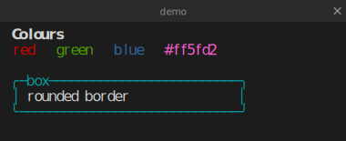

| Property | Type | Required | Description |
| --- | --- | --- | --- |
| `cols` | `i64` | no | Grid width in cells (default `80`; a `.cast` header overrides it). |
| `rows` | `i64` | no | Grid height in cells (default `24`; a `.cast` header overrides it). |
| `font_size` | `f64` | no | Cell metric: font size. |
| `line_height` | `f64` | no | Cell metric: line height. |
| `palette` | `symbol` | no | Seed colours: `:default` (dark) or `:light`. |
| `fg` | `utf8` | no | Explicit default foreground override. |
| `bg` | `utf8` | no | Explicit default background override. |
| `chrome` | `bool` | no | Draw a window title bar (default `true`). |
| `title` | `utf8` | no | Title shown in the chrome bar. |
| `text` | `utf8` | no | Inline content fed to the virtual terminal (ANSI included). |
| `source` | `utf8` | no | Path to an asciinema `.cast` recording to replay. |
| `autoplay` | `bool` | no | Replay control: start playing automatically. |
| `loop` | `bool` | no | Replay control: loop playback. |
| `speed` | `f64` | no | Replay control: playback speed multiplier. |
| `id` | `identifier` | no | Optional explicit HTML id. |
| `class` | `list<utf8>` | no | Style classes (the `class` themes the window `<div>`). |

#### Child blocks

| Slot | Accepts | Multiple | Description |
| --- | --- | --- | --- |
| `children` | `TermPrimitive` | yes | Placeable terminal primitives and widgets. |

## Primitives

`term_text` is the one base primitive — styled text at a 1-based `(row, col)` carrying `fg` / `bg` and `bold` / `italic` / `underline`. Higher-level helpers (`term_box`, `term_glyph`, `term_fill`) lower to runs of `term_text`. Colours are strings: an ANSI name (`"red"`), a 256-palette index (`"208"`), or a hex (`"#ff5fd2"`). All four side by side:

```wcl
terminal {
  cols = 40
  rows = 9
  title = "primitives"
  term_text "term_text — styled" {
    row = 1
    col = 2
    fg = "green"
    bold = true
  }
  term_box {
    row = 3
    col = 2
    width = 22
    height = 3
    border = :rounded
    fg = "cyan"
    title = "term_box"
  }
  term_glyph "★" {
    row = 4
    col = 27
    fg = "yellow"
  }
  term_text "term_glyph" {
    row = 4
    col = 29
  }
  term_fill "░" {
    row = 7
    col = 2
    width = 36
    height = 1
    fg = "magenta"
  }
  term_text "term_fill" {
    row = 8
    col = 2
  }
}
```

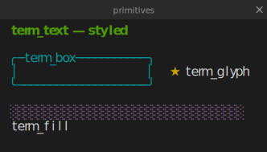

Styled text at a 1-based `(row, col)` carrying `fg` / `bg` and `bold` / `italic` / `underline` — the one base primitive every other terminal helper lowers to.

| Property | Type | Required | Description |
| --- | --- | --- | --- |
| `content` | `utf8` | yes | The text (`@inline(0)`, so `term_text "hi" { … }`). |
| `row` | `i64` | yes | 1-based grid row. |
| `col` | `i64` | yes | 1-based grid column. |
| `fg` | `utf8` | no | Foreground colour — ANSI name, 256 index, or `#hex`. |
| `bg` | `utf8` | no | Background colour — ANSI name, 256 index, or `#hex`. |
| `bold` | `bool` | no | Bold style. |
| `dim` | `bool` | no | Dim style. |
| `italic` | `bool` | no | Italic style. |
| `underline` | `bool` | no | Underline style. |
| `strike` | `bool` | no | Strikethrough style. |
| `blink` | `bool` | no | Blink style. |
| `inverse` | `bool` | no | Inverse (swap fg/bg) style. |
| `conceal` | `bool` | no | Conceal (hide) style. |

A box drawn with line-drawing characters at `(row, col)` over a `width` / `height`, with a `border` style (`:rounded`, …) and an optional `title`.

| Property | Type | Required | Description |
| --- | --- | --- | --- |
| `row` | `i64` | yes | 1-based grid row. |
| `col` | `i64` | yes | 1-based grid column. |
| `width` | `i64` | yes | Box width in cells. |
| `height` | `i64` | yes | Box height in cells. |
| `border` | `symbol` | no | Border style: `:single` (default) / `:double` / `:rounded` / `:heavy` / `:ascii`. |
| `title` | `utf8` | no | Optional title drawn into the top border. |
| `fg` | `utf8` | no | Foreground colour. |
| `bg` | `utf8` | no | Background colour. |
| `bold` | `bool` | no | Bold style. |

A single placed glyph at `(row, col)` — handy for sigils, spinners, and box-drawing accents that aren't full text runs.

| Property | Type | Required | Description |
| --- | --- | --- | --- |
| `glyph` | `utf8` | yes | The text run (may contain `\n`), `@inline(0)`. |
| `row` | `i64` | yes | 1-based grid row. |
| `col` | `i64` | yes | 1-based grid column. |
| `fg` | `utf8` | no | Foreground colour. |
| `bg` | `utf8` | no | Background colour. |
| `bold` | `bool` | no | Bold style. |

Fills a rectangular region of the grid with a repeated character and colour, for backgrounds and shading.

| Property | Type | Required | Description |
| --- | --- | --- | --- |
| `ch` | `utf8` | yes | The fill character (`@inline(0)`). |
| `row` | `i64` | yes | 1-based grid row. |
| `col` | `i64` | yes | 1-based grid column. |
| `width` | `i64` | yes | Region width in cells. |
| `height` | `i64` | yes | Region height in cells. |
| `fg` | `utf8` | no | Foreground colour. |
| `bg` | `utf8` | no | Background colour. |
| `bold` | `bool` | no | Bold style. |

## Inline ANSI and asciinema replay

Set `text = "…"` and the bundled `avt` virtual terminal evaluates it — ANSI sequences, cursor movement, and styling all apply (a bare `\n` is a newline). Set `source = "rec.cast"` for asciinema replay; frames replay at the recording's pace (override with `speed`) and stop at the end unless `loop = true`.

```wcl
terminal {
  cols = 30
  rows = 3
  title = "inline"
  text = "first line\nsecond line"
}
```

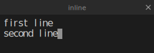

## TUI widgets

Inside a `terminal`, stdlib TUI controls compose a small interface — each lowers to runs of `term_text`. Place each from its own `(row, col)`; container widgets position their children relative to themselves.

```wcl
terminal {
  cols = 44
  rows = 8
  title = "controls"
  term_text "Progress" {
    row = 1
    col = 2
    bold = true
    underline = true
  }
  tui_progress "Upload" {
    row = 2
    col = 2
    value = 78
  }
  tui_progress "Sync" {
    row = 3
    col = 2
    value = 40
    accent = "cyan"
  }
  term_text "Buttons" {
    row = 5
    col = 2
    bold = true
    underline = true
  }
  tui_button "Save" {
    row = 6
    col = 2
    accent = "green"
  }
  tui_button "Discard" {
    row = 6
    col = 11
    accent = "red"
  }
}
```

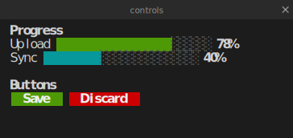

### tui_progress

A two-tone progress bar; `value` runs `0`–`max` (default `100`), the `@inline` label sits to its left, and `show_value` appends a percentage.

```wcl
terminal {
  cols = 38
  rows = 1
  chrome = false
  tui_progress "Upload" {
    row = 1
    col = 1
    value = 65
  }
}
```

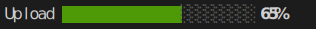

| Property | Type | Required | Description |
| --- | --- | --- | --- |
| `label` | `utf8` | no | Optional `@inline` caption to the left of the bar. |
| `value` | `i64` | yes | Filled amount (clamped to `0`..`max`). |
| `max` | `i64` | no | Scale maximum (default `100`). |
| `width` | `i64` | no | Bar width in cells (default `24`). |
| `show_value` | `bool` | no | Append a `NN%` readout (default `true`). |
| `accent` | `utf8` | no | Fill colour. |
| `muted` | `utf8` | no | Track colour. |
| `row` | `i64` | yes | 1-based grid row. |
| `col` | `i64` | yes | 1-based grid column. |

### tui_button

A solid accent-fill button; the `@inline` label is centred, `width` pads it, `accent` colours the fill.

```wcl
terminal {
  cols = 24
  rows = 1
  chrome = false
  tui_button "Save" {
    row = 1
    col = 1
    accent = "green"
  }
  tui_button "Quit" {
    row = 1
    col = 9
    accent = "red"
  }
}
```


| Property | Type | Required | Description |
| --- | --- | --- | --- |
| `label` | `utf8` | yes | Button text (`@inline`). |
| `width` | `i64` | no | Total width (default = label + padding). |
| `accent` | `utf8` | no | Fill colour (default `blue`). |
| `fg` | `utf8` | no | Label colour (default `bright_white`). |
| `row` | `i64` | yes | 1-based grid row. |
| `col` | `i64` | yes | 1-based grid column. |

### tui_input

A single-line field with a left accent bar. With no `value` the `@inline` placeholder shows muted; `focused = true` draws a cursor.

```wcl
terminal {
  cols = 30
  rows = 2
  chrome = false
  tui_input "Search projects" {
    row = 1
    col = 1
    focused = true
  }
  tui_input "Name" {
    row = 2
    col = 1
    value = "Ada Lovelace"
  }
}
```


| Property | Type | Required | Description |
| --- | --- | --- | --- |
| `placeholder` | `utf8` | yes | Muted prompt shown when empty (`@inline`). |
| `value` | `utf8` | no | Current text (overrides the placeholder). |
| `focused` | `bool` | no | Draw a trailing cursor. |
| `accent` | `utf8` | no | Bar / cursor colour. |
| `row` | `i64` | yes | 1-based grid row. |
| `col` | `i64` | yes | 1-based grid column. |

### tui_dropdown

A drop-down with a disclosure caret (`▾` closed, `▴` open). With `open = true` and an `items` list, the options drop below the field and the selected one is highlighted.

```wcl
terminal {
  cols = 28
  rows = 4
  chrome = false
  tui_dropdown "Release build" {
    row = 1
    col = 1
    open = true
    items = ["Debug build", "Release build", "Profile build"]
  }
}
```

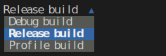

| Property | Type | Required | Description |
| --- | --- | --- | --- |
| `text` | `utf8` | yes | Selected / shown label (`@inline`). |
| `items` | `list<utf8>` | no | Option list shown below the field when `open`. |
| `selected` | `i64` | no | Highlighted item index (default: the item equal to `text`). |
| `width` | `i64` | no | Field width (default: fits the label and longest item). |
| `open` | `bool` | no | Drop the list down (and flip the caret). |
| `accent` | `utf8` | no | Caret + selected-row colour. |
| `row` | `i64` | yes | 1-based grid row. |
| `col` | `i64` | yes | 1-based grid column. |

### tui_checkbox

An on/off checkbox; `checked = true` fills the marker in the accent colour.

```wcl
terminal {
  cols = 24
  rows = 2
  chrome = false
  tui_checkbox "Telemetry" {
    row = 1
    col = 1
    checked = true
  }
  tui_checkbox "Beta" {
    row = 2
    col = 1
  }
}
```

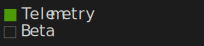

| Property | Type | Required | Description |
| --- | --- | --- | --- |
| `label` | `utf8` | yes | Checkbox caption (`@inline`). |
| `checked` | `bool` | no | On/off state. |
| `accent` | `utf8` | no | Checked colour. |
| `muted` | `utf8` | no | Unchecked colour. |
| `row` | `i64` | yes | 1-based grid row. |
| `col` | `i64` | yes | 1-based grid column. |

### tui_radio

A radio button — like a checkbox but round; `selected = true` marks the active choice in a group you lay out yourself.

```wcl
terminal {
  cols = 24
  rows = 2
  chrome = false
  tui_radio "Dark" {
    row = 1
    col = 1
    selected = true
  }
  tui_radio "Light" {
    row = 2
    col = 1
  }
}
```

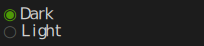

| Property | Type | Required | Description |
| --- | --- | --- | --- |
| `label` | `utf8` | yes | Radio caption (`@inline`). |
| `selected` | `bool` | no | Whether this option is chosen. |
| `accent` | `utf8` | no | Selected colour. |
| `muted` | `utf8` | no | Unselected colour. |
| `row` | `i64` | yes | 1-based grid row. |
| `col` | `i64` | yes | 1-based grid column. |

### tui_spinner

A single static spinner frame — pick the `kind` (`:braille` default, `:circle`, `:line`) and which `frame` to show, with an optional `@inline` label.

```wcl
terminal {
  cols = 24
  rows = 1
  chrome = false
  tui_spinner "Building…" {
    row = 1
    col = 1
    frame = 2
  }
}
```

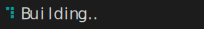

| Property | Type | Required | Description |
| --- | --- | --- | --- |
| `label` | `utf8` | no | Optional `@inline` caption after the frame. |
| `frame` | `i64` | no | Which frame index to show (default `0`). |
| `kind` | `symbol` | no | Glyph set: `:dots`/`:braille` (default) / `:circle` / `:line`. |
| `accent` | `utf8` | no | Frame colour. |
| `row` | `i64` | yes | 1-based grid row. |
| `col` | `i64` | yes | 1-based grid column. |

### tui_panel

A bordered container: it draws a box (optional `title`) and renders its child controls inset by one cell. Child positions are **relative to the panel**.

```wcl
terminal {
  cols = 30
  rows = 6
  chrome = false
  tui_panel {
    row = 1
    col = 1
    width = 30
    height = 6
    title = "Status"
    tui_progress "Load" {
      row = 1
      col = 1
      value = 50
      width = 16
    }
    tui_button "Go" {
      row = 3
      col = 1
      accent = "green"
    }
  }
}
```

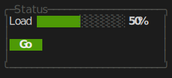

| Property | Type | Required | Description |
| --- | --- | --- | --- |
| `title` | `utf8` | no | Optional heading drawn into the top border. |
| `width` | `i64` | yes | Box width in cells. |
| `height` | `i64` | yes | Box height in cells. |
| `border` | `symbol` | no | Border style: `:rounded` (default) / `:single` / `:double` / `:heavy` / `:ascii`. |
| `accent` | `utf8` | no | Border colour. |
| `row` | `i64` | yes | 1-based grid row. |
| `col` | `i64` | yes | 1-based grid column. |

#### Child blocks

| Slot | Accepts | Multiple | Description |
| --- | --- | --- | --- |
| `children` | `TermPrimitive` | yes | `TermPrimitive` children, positioned relative to the panel. |

### tui_group

A borderless container — an optional `title` then its children. Use it to offset a cluster of controls without drawing a box.

```wcl
terminal {
  cols = 26
  rows = 3
  chrome = false
  tui_group {
    row = 1
    col = 1
    title = "Options"
    tui_checkbox "Telemetry" {
      row = 1
      col = 1
      checked = true
    }
    tui_radio "Dark" {
      row = 2
      col = 1
      selected = true
    }
  }
}
```

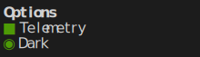

| Property | Type | Required | Description |
| --- | --- | --- | --- |
| `title` | `utf8` | no | Optional heading above the children. |
| `row` | `i64` | yes | 1-based grid row. |
| `col` | `i64` | yes | 1-based grid column. |

#### Child blocks

| Slot | Accepts | Multiple | Description |
| --- | --- | --- | --- |
| `children` | `TermPrimitive` | yes | `TermPrimitive` children, positioned relative to the group. |

## Custom TUI widgets

TUI widgets are user-extensible. Declare a `@block("name") type … extends TuiWidget` with a `lower` returning `list<TermFundamental>`, and it plugs into the renderer like the built-ins — a legal child of any `terminal` (or container). Lay it out from its own top-left `(1, 1)`; the renderer offsets it by the widget's placement. Build the output from the shared `term_run` / `term_repeat` helpers, since styled text is the only thing the renderer paints.

Here's a `kbd` keycap — a coloured background run with the key label on top, the accent overridable per instance:

```wcl
terminal {
  cols = 30
  rows = 1
  chrome = false
  kbd "Ctrl" {
    row = 1
    col = 1
  }
  kbd "K" {
    row = 1
    col = 8
    accent = "blue"
  }
}
```

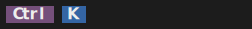

```wcl
// Extends TuiWidget → a legal terminal child. The lower returns styled text
// runs (a background of spaces + the label on top).
@block("kbd")
type Kbd extends TuiWidget {
  @inline(0) key: utf8
  accent: utf8?
  row: i64  col: i64
  lower = fn(k: Kbd) -> list<TermFundamental> {
    let acc = if k.accent == none { "magenta" } else { k.accent };
    let w = len(k.key) + 2;
    [
      term_run(term_repeat(" ", w), 1, 1, none, acc, none),
      term_run(k.key, 1, 2, "bright_white", acc, true),
    ]
  }
}

terminal { cols = 30  rows = 1  chrome = false
  kbd "Ctrl" { row = 1  col = 1 }
  kbd "K"    { row = 1  col = 8  accent = "blue" }
}
```

## Related

- [Wireframes](../references/fact_wireframe.md)

- [diagram](../references/fact_diagrams.md)

[← Back to SKILL.md](../SKILL.md)
