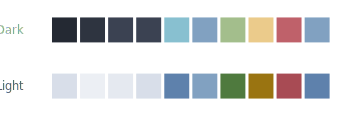

# Nordic theme

`theme = :nord` — cool blue-grey. Dark (top) and light (bottom): page, surface, border, accent, accent-2, tip, warn, danger, keyword. See [all themes](../references/fact_themes.md).

## Related

- [Built-in colour themes](../references/fact_themes.md)

[← Back to SKILL.md](../SKILL.md)
