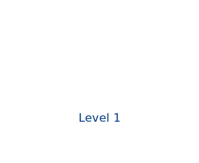

# tilemaps

A `tilemap` draws a 2D grid of indexed tiles cropped from a shared spritesheet. A `tileset` names that spritesheet plus its slice geometry and hangs off the document root (like `iconset`); tile index N maps to sheet column `N % columns`, row `N / columns`. The tilemap is a diagram shape, so anything drawn after it overlays on top.

A symbolic level map painted from Kenney's CC0 "Platformer Pack", with a label overlaid on top:

```wcl
diagram {
  width = 280
  height = 230
  tilemap {
    set = "platformer"
    scale = 0.5
    tile "#" {
      index = 25
    }  # brown crate — ground
    tile "~" {
      index = 1
    }  # water surface
    tile "=" {
      index = 6
    }  # deep water
    tile "T" {
      index = 16
    }  # torch
    tile "G" {
      index = 28
    }  # grass tuft
    map = ["........", "........", ".T.G....", "########", "~~~~~~~~", "========"]
  }
  # Overlaid after the tilemap, so it sits over the tiles.
  label "Level 1" {
    x = 128.0
    y = 146.0
    font_size = 16.0
    fill = "#003a8c"
  }
}
```



## Declaring a tileset

A root-level declaration that names a spritesheet and its slice geometry (`tile_width` / `tile_height` / `columns`); tile index N maps to sheet column `N % columns`, row `N / columns`.

| Property | Type | Required | Description |
| --- | --- | --- | --- |
| `name` | `identifier` | yes | Reference name (the inline label), e.g. `dungeon`. |
| `source` | `utf8` | yes | Image path, relative to the build entry file. |
| `tile_width` | `i64` | yes | Source tile pixel width. |
| `tile_height` | `i64` | yes | Source tile pixel height. |
| `columns` | `i64` | no | Tiles per sheet row — maps an index to a coordinate (auto-fit from the sheet width otherwise). |
| `margin` | `i64` | no | Pixel border around the whole sheet (default `0`). |
| `spacing` | `i64` | no | Pixel gap between tiles (default `0`). |
| `image_width` | `i64` | no | Override the auto-detected sheet pixel width. |
| `image_height` | `i64` | no | Override the auto-detected sheet pixel height. |

```wcl
tileset platformer {
  source      = "assets/kenney-platformer.png"
  tile_width  = 64
  tile_height = 64
  columns     = 5
}
```

The set's tiles, by index — a single numeric `tiles` row doubles as a palette of what the sheet can paint:

```wcl
diagram {
  width = 320
  height = 44
  tilemap {
    set = "platformer"
    scale = 0.6
    tiles = [[25, 9, 1, 6, 16, 28, 27, 37]]
  }
}
```


## Symbolic and numeric maps

For map-like authoring, declare a glyph legend with `tile` children and supply `map` — a list of utf8 rows; each character resolves through the legend to a tile index (an unmapped glyph draws nothing). Or write raw index rows with `tiles` (one inner list per row); `-1`, the default `empty` index, leaves a cell blank.

The numeric form — raw index rows, `-1` for a blank cell:

```wcl
diagram {
  width = 180
  height = 120
  tilemap {
    set = "platformer"
    scale = 0.5
    tiles = [[16, -1, 28], [25, 25, 25], [1, 1, 1]]
  }
}
```


A placeable diagram shape that paints a grid of indexed tiles from a `tileset`, authored either symbolically via `map` (utf8 rows through a glyph legend) or numerically via `tiles` (raw index rows).

| Property | Type | Required | Description |
| --- | --- | --- | --- |
| `set` | `identifier` | yes | Name of the `tileset` to slice from. |
| `tiles` | `list<list<i64>>` | no | Numeric grid — `list<list<i64>>`, one inner list per row. |
| `map` | `list<utf8>` | no | Symbolic grid — `list<utf8>` rows resolved through the `tile` legend (wins over `tiles`). |
| `empty` | `i64` | no | Index meaning "no tile" (default `-1`). |
| `scale` | `f64` | no | Display scale (default `1.0`). |
| `smooth` | `bool` | no | Anti-alias instead of the default `image-rendering: pixelated`. |
| `x` | `f64` | no | Position x within the enclosing `diagram` / `container`. |
| `y` | `f64` | no | Position y within the enclosing `diagram` / `container`. |
| `id` | `identifier` | no | Optional explicit HTML id. |
| `class` | `list<utf8>` | no | Optional style classes. |
| `anchor_left` | `f64` | no | Diagram anchor insets (left/right/top/bottom), like any `SvgBlock`. |
| `connect_points` | `list<AnchorSide>` | no | Diagram edge-attach sides, like any `SvgBlock`. |

#### Child blocks

| Slot | Accepts | Multiple | Description |
| --- | --- | --- | --- |
| `legend` | `tile` | yes | Glyph legend — `tile "#" { index = N }` entries mapping a glyph to a tile index. |

A `tile` child of a tilemap that binds one legend glyph to a tile `index`.

| Property | Type | Required | Description |
| --- | --- | --- | --- |
| `glyph` | `utf8` | yes | Single character used in `map` (the inline label). |
| `index` | `i64` | yes | Tile index the glyph stands for. |

`scale` sizes the display; `image-rendering: pixelated` is the default, and `smooth = true` opts into the browser's smoothing. The sheet is copied to `_wdoc/`, so tiles resolve when served.

## Related

- [dopesheet](../references/fact_dopesheets.md)

- [image](../references/fact_images.md)

- [diagram](../references/fact_diagrams.md)

[← Back to SKILL.md](../SKILL.md)
