# Wireframes

Wireframe widgets mock up a UI — windows, device frames (browser / phone / tablet), panels, inputs, controls — as **diagram shapes**. Each `wf_*` block extends `SvgBlock`, so it lives inside a `diagram`: place it with `x` / `y` (or anchors), connect widgets with edges, and mix them with any other shape. Container widgets nest other widgets, so you compose a window of panels of rows of controls. They're static SVG mockups, not interactive.

```wcl
diagram {
  width = 300
  height = 200
  wf_window "Account settings" {
    wf_panel {
      title = "Profile"
      wf_input "Display name" {
        value = "Wil Taylor"
      }
      wf_input "Email" {
        value = "ai@wiltaylor.dev"
      }
    }
    wf_row {
      wf_button "Cancel"
      wf_button "Save" {
        icon = "lucide.check"
      }
    }
  }
}
```

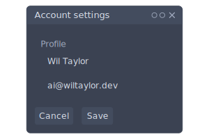

## Placing and connecting widgets

Because widgets are diagram shapes, place them by `x` / `y` and draw edges between them by `id` — just like connecting any two shapes. A widget is sized by its content, so you only position the top-left corner. Under an auto-layout `diagram` (`layout = :layered` / `:force`), omit `x` / `y` and let the solver flow them.

```wcl
diagram {
  width = 360
  height = 170
  wf_button "Open settings" {
    id = launch
    x = 20.0
    y = 65.0
  }
  wf_window "Settings" {
    id = win
    x = 180.0
    y = 20.0
    wf_checkbox "Dark mode" {
      checked = true
    }
    wf_button "Close"
  }
  launch -> win
}
```

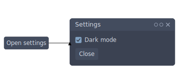

## Containers

Every container takes `@children(Widget)` — drop any other widget inside, nested arbitrarily. The Rust renderer measures and lays the children out internally (their `x` / `y` are ignored; only the root widget's placement positions the whole group). Device frames have a realistic fixed default size; everything else is sized to its content.

### wf_window

The outer desktop chrome: a titlebar (traffic-light controls, hidden by `controls = false`) over a body that hosts other widgets, stacked vertically.

```wcl
diagram {
  width = 300
  height = 110
  wf_window "Settings" {
    wf_label "The window body stacks its children vertically."
  }
}
```

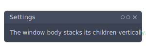

| Property | Type | Required | Description |
| --- | --- | --- | --- |
| `title` | `utf8` | yes | Titlebar caption (the inline label). |
| `controls` | `bool` | no | Show the titlebar dots + close glyph (default `true`). |
| `id` | `identifier` | no | Optional HTML id (also the edge-connection / anchor name). |
| `class` | `list<utf8>` | no | Extra CSS classes threaded onto the rendered element (and read for `background` / `color` / `border` overrides). |
| `disabled` | `bool` | no | When `true`, dims the control (renders at reduced opacity). |
| `x` | `f64` | no | Top-left x placement in the diagram (or use anchors). |
| `y` | `f64` | no | Top-left y placement in the diagram (or use anchors). |
| `width` | `f64` | no | Advisory box width (the widget is normally content-measured). |
| `height` | `f64` | no | Advisory box height (the widget is normally content-measured). |
| `anchor_left` | `f64` | no | Fractional anchor (0–1) pinning the left edge to the parent box. |
| `anchor_right` | `f64` | no | Fractional anchor (0–1) pinning the right edge to the parent box. |
| `anchor_top` | `f64` | no | Fractional anchor (0–1) pinning the top edge to the parent box. |
| `anchor_bottom` | `f64` | no | Fractional anchor (0–1) pinning the bottom edge to the parent box. |
| `connect_points` | `list<AnchorSide>` | no | Which sides (`:left`/`:right`/`:top`/`:bottom`) edges attach to. |
| `theme` | `symbol` | no | Per-element UI-theme override naming a `theme` block (falls back to the site's `ui_*` theme, then the document theme). |
| `accent` | `symbol` | no | Per-element accent hue override (falls back to the site / document theme). |
| `mode` | `symbol` | no | Per-element mode override: `:dark` or `:light` (falls back to the site / document theme). |

#### Child blocks

| Slot | Accepts | Multiple | Description |
| --- | --- | --- | --- |
| `children` | `Widget` | yes | Any `Widget`s, stacked vertically. |

### wf_browser

A web-browser frame: a toolbar with traffic-light dots and an address bar (the inline label is the URL) over a content area. Drop a `wf_window` or any controls inside to mock up a web app.

```wcl
diagram {
  width = 480
  height = 260
  wf_browser "app.example.com/dashboard" {
    wf_panel {
      title = "Welcome back"
      wf_input "Search…"
      wf_row {
        wf_button "Open"
        wf_button "New" {
          icon = "lucide.check"
        }
      }
    }
  }
}
```

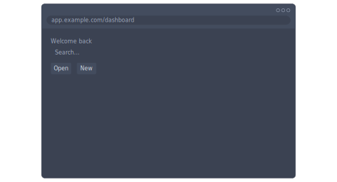

| Property | Type | Required | Description |
| --- | --- | --- | --- |
| `url` | `utf8` | yes | Address-bar URL (the inline label). |
| `id` | `identifier` | no | Optional HTML id (also the edge-connection / anchor name). |
| `class` | `list<utf8>` | no | Extra CSS classes threaded onto the rendered element (and read for `background` / `color` / `border` overrides). |
| `disabled` | `bool` | no | When `true`, dims the control (renders at reduced opacity). |
| `x` | `f64` | no | Top-left x placement in the diagram (or use anchors). |
| `y` | `f64` | no | Top-left y placement in the diagram (or use anchors). |
| `width` | `f64` | no | Advisory box width (the widget is normally content-measured). |
| `height` | `f64` | no | Advisory box height (the widget is normally content-measured). |
| `anchor_left` | `f64` | no | Fractional anchor (0–1) pinning the left edge to the parent box. |
| `anchor_right` | `f64` | no | Fractional anchor (0–1) pinning the right edge to the parent box. |
| `anchor_top` | `f64` | no | Fractional anchor (0–1) pinning the top edge to the parent box. |
| `anchor_bottom` | `f64` | no | Fractional anchor (0–1) pinning the bottom edge to the parent box. |
| `connect_points` | `list<AnchorSide>` | no | Which sides (`:left`/`:right`/`:top`/`:bottom`) edges attach to. |
| `theme` | `symbol` | no | Per-element UI-theme override naming a `theme` block (falls back to the site's `ui_*` theme, then the document theme). |
| `accent` | `symbol` | no | Per-element accent hue override (falls back to the site / document theme). |
| `mode` | `symbol` | no | Per-element mode override: `:dark` or `:light` (falls back to the site / document theme). |

#### Child blocks

| Slot | Accepts | Multiple | Description |
| --- | --- | --- | --- |
| `children` | `Widget` | yes | Any `Widget`s, stacked vertically in the content area. |

### wf_phone

A phone shell — a bezel around a screen with a status bar (the inline label is an optional caption) and a home-indicator pill. Set `orientation = :landscape` to rotate it; the default is `:portrait`.

```wcl
diagram {
  width = 320
  height = 480
  wf_phone "9:41" {
    wf_panel {
      title = "Account"
      wf_input "Email" {
        value = "ada@example.com"
      }
      wf_toggle "Notifications" {
        on = true
      }
    }
    wf_button "Sign in" {
      icon = "lucide.check"
    }
  }
}
```

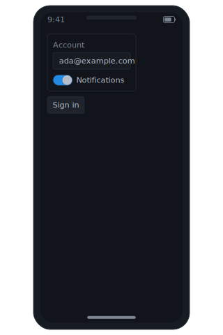

| Property | Type | Required | Description |
| --- | --- | --- | --- |
| `title` | `utf8` | no | Optional status-bar caption (the inline label). |
| `orientation` | `symbol` | no | Frame orientation: `:portrait` (default) or `:landscape`. |
| `id` | `identifier` | no | Optional HTML id (also the edge-connection / anchor name). |
| `class` | `list<utf8>` | no | Extra CSS classes threaded onto the rendered element (and read for `background` / `color` / `border` overrides). |
| `disabled` | `bool` | no | When `true`, dims the control (renders at reduced opacity). |
| `x` | `f64` | no | Top-left x placement in the diagram (or use anchors). |
| `y` | `f64` | no | Top-left y placement in the diagram (or use anchors). |
| `width` | `f64` | no | Advisory box width (the widget is normally content-measured). |
| `height` | `f64` | no | Advisory box height (the widget is normally content-measured). |
| `anchor_left` | `f64` | no | Fractional anchor (0–1) pinning the left edge to the parent box. |
| `anchor_right` | `f64` | no | Fractional anchor (0–1) pinning the right edge to the parent box. |
| `anchor_top` | `f64` | no | Fractional anchor (0–1) pinning the top edge to the parent box. |
| `anchor_bottom` | `f64` | no | Fractional anchor (0–1) pinning the bottom edge to the parent box. |
| `connect_points` | `list<AnchorSide>` | no | Which sides (`:left`/`:right`/`:top`/`:bottom`) edges attach to. |
| `theme` | `symbol` | no | Per-element UI-theme override naming a `theme` block (falls back to the site's `ui_*` theme, then the document theme). |
| `accent` | `symbol` | no | Per-element accent hue override (falls back to the site / document theme). |
| `mode` | `symbol` | no | Per-element mode override: `:dark` or `:light` (falls back to the site / document theme). |

#### Child blocks

| Slot | Accepts | Multiple | Description |
| --- | --- | --- | --- |
| `children` | `Widget` | yes | Any `Widget`s, stacked vertically on the screen. |

### wf_tablet

A tablet shell — the same chrome as `wf_phone` on a larger, squarer frame. Shown here in landscape:

```wcl
diagram {
  width = 460
  height = 320
  wf_tablet {
    orientation = :landscape
    wf_row {
      wf_panel {
        title = "Library"
        wf_label "Recent"
        wf_label "Favourites"
      }
      wf_panel {
        title = "Reader"
        wf_label "Select an item to read."
      }
    }
  }
}
```

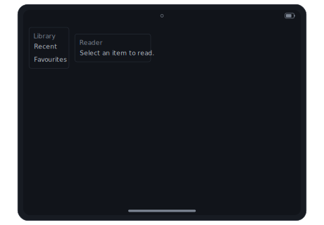

| Property | Type | Required | Description |
| --- | --- | --- | --- |
| `title` | `utf8` | no | Optional status-bar caption (the inline label). |
| `orientation` | `symbol` | no | Frame orientation: `:portrait` (default) or `:landscape`. |
| `id` | `identifier` | no | Optional HTML id (also the edge-connection / anchor name). |
| `class` | `list<utf8>` | no | Extra CSS classes threaded onto the rendered element (and read for `background` / `color` / `border` overrides). |
| `disabled` | `bool` | no | When `true`, dims the control (renders at reduced opacity). |
| `x` | `f64` | no | Top-left x placement in the diagram (or use anchors). |
| `y` | `f64` | no | Top-left y placement in the diagram (or use anchors). |
| `width` | `f64` | no | Advisory box width (the widget is normally content-measured). |
| `height` | `f64` | no | Advisory box height (the widget is normally content-measured). |
| `anchor_left` | `f64` | no | Fractional anchor (0–1) pinning the left edge to the parent box. |
| `anchor_right` | `f64` | no | Fractional anchor (0–1) pinning the right edge to the parent box. |
| `anchor_top` | `f64` | no | Fractional anchor (0–1) pinning the top edge to the parent box. |
| `anchor_bottom` | `f64` | no | Fractional anchor (0–1) pinning the bottom edge to the parent box. |
| `connect_points` | `list<AnchorSide>` | no | Which sides (`:left`/`:right`/`:top`/`:bottom`) edges attach to. |
| `theme` | `symbol` | no | Per-element UI-theme override naming a `theme` block (falls back to the site's `ui_*` theme, then the document theme). |
| `accent` | `symbol` | no | Per-element accent hue override (falls back to the site / document theme). |
| `mode` | `symbol` | no | Per-element mode override: `:dark` or `:light` (falls back to the site / document theme). |

#### Child blocks

| Slot | Accepts | Multiple | Description |
| --- | --- | --- | --- |
| `children` | `Widget` | yes | Any `Widget`s, stacked vertically on the screen. |

### wf_panel

A bordered group with an optional `title` caption — box a set of related controls.

```wcl
diagram {
  width = 220
  height = 120
  wf_panel {
    title = "Network"
    wf_toggle "Wi-Fi" {
      on = true
    }
    wf_toggle "Bluetooth"
  }
}
```

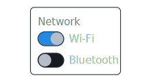

| Property | Type | Required | Description |
| --- | --- | --- | --- |
| `title` | `utf8` | no | Optional group caption. |
| `id` | `identifier` | no | Optional HTML id (also the edge-connection / anchor name). |
| `class` | `list<utf8>` | no | Extra CSS classes threaded onto the rendered element (and read for `background` / `color` / `border` overrides). |
| `disabled` | `bool` | no | When `true`, dims the control (renders at reduced opacity). |
| `x` | `f64` | no | Top-left x placement in the diagram (or use anchors). |
| `y` | `f64` | no | Top-left y placement in the diagram (or use anchors). |
| `width` | `f64` | no | Advisory box width (the widget is normally content-measured). |
| `height` | `f64` | no | Advisory box height (the widget is normally content-measured). |
| `anchor_left` | `f64` | no | Fractional anchor (0–1) pinning the left edge to the parent box. |
| `anchor_right` | `f64` | no | Fractional anchor (0–1) pinning the right edge to the parent box. |
| `anchor_top` | `f64` | no | Fractional anchor (0–1) pinning the top edge to the parent box. |
| `anchor_bottom` | `f64` | no | Fractional anchor (0–1) pinning the bottom edge to the parent box. |
| `connect_points` | `list<AnchorSide>` | no | Which sides (`:left`/`:right`/`:top`/`:bottom`) edges attach to. |
| `theme` | `symbol` | no | Per-element UI-theme override naming a `theme` block (falls back to the site's `ui_*` theme, then the document theme). |
| `accent` | `symbol` | no | Per-element accent hue override (falls back to the site / document theme). |
| `mode` | `symbol` | no | Per-element mode override: `:dark` or `:light` (falls back to the site / document theme). |

#### Child blocks

| Slot | Accepts | Multiple | Description |
| --- | --- | --- | --- |
| `children` | `Widget` | yes | Any `Widget`s, stacked vertically. |

### wf_row

Lay children out **horizontally** (a panel / window body stacks vertically by default).

```wcl
diagram {
  width = 320
  height = 50
  wf_row {
    wf_button "Back"
    wf_button "Next"
    wf_button "Finish" {
      icon = "lucide.check"
    }
  }
}
```


| Property | Type | Required | Description |
| --- | --- | --- | --- |
| `id` | `identifier` | no | Optional HTML id (also the edge-connection / anchor name). |
| `class` | `list<utf8>` | no | Extra CSS classes threaded onto the rendered element (and read for `background` / `color` / `border` overrides). |
| `disabled` | `bool` | no | When `true`, dims the control (renders at reduced opacity). |
| `x` | `f64` | no | Top-left x placement in the diagram (or use anchors). |
| `y` | `f64` | no | Top-left y placement in the diagram (or use anchors). |
| `width` | `f64` | no | Advisory box width (the widget is normally content-measured). |
| `height` | `f64` | no | Advisory box height (the widget is normally content-measured). |
| `anchor_left` | `f64` | no | Fractional anchor (0–1) pinning the left edge to the parent box. |
| `anchor_right` | `f64` | no | Fractional anchor (0–1) pinning the right edge to the parent box. |
| `anchor_top` | `f64` | no | Fractional anchor (0–1) pinning the top edge to the parent box. |
| `anchor_bottom` | `f64` | no | Fractional anchor (0–1) pinning the bottom edge to the parent box. |
| `connect_points` | `list<AnchorSide>` | no | Which sides (`:left`/`:right`/`:top`/`:bottom`) edges attach to. |
| `theme` | `symbol` | no | Per-element UI-theme override naming a `theme` block (falls back to the site's `ui_*` theme, then the document theme). |
| `accent` | `symbol` | no | Per-element accent hue override (falls back to the site / document theme). |
| `mode` | `symbol` | no | Per-element mode override: `:dark` or `:light` (falls back to the site / document theme). |

#### Child blocks

| Slot | Accepts | Multiple | Description |
| --- | --- | --- | --- |
| `children` | `Widget` | yes | Any `Widget`s, laid out left-to-right. |

### wf_column

Stack children **vertically** — the default flow, useful for an explicit column inside a `wf_row` or `wf_grid`.

```wcl
diagram {
  width = 220
  height = 80
  wf_column {
    wf_label "Name"
    wf_input "Full name"
  }
}
```


| Property | Type | Required | Description |
| --- | --- | --- | --- |
| `id` | `identifier` | no | Optional HTML id (also the edge-connection / anchor name). |
| `class` | `list<utf8>` | no | Extra CSS classes threaded onto the rendered element (and read for `background` / `color` / `border` overrides). |
| `disabled` | `bool` | no | When `true`, dims the control (renders at reduced opacity). |
| `x` | `f64` | no | Top-left x placement in the diagram (or use anchors). |
| `y` | `f64` | no | Top-left y placement in the diagram (or use anchors). |
| `width` | `f64` | no | Advisory box width (the widget is normally content-measured). |
| `height` | `f64` | no | Advisory box height (the widget is normally content-measured). |
| `anchor_left` | `f64` | no | Fractional anchor (0–1) pinning the left edge to the parent box. |
| `anchor_right` | `f64` | no | Fractional anchor (0–1) pinning the right edge to the parent box. |
| `anchor_top` | `f64` | no | Fractional anchor (0–1) pinning the top edge to the parent box. |
| `anchor_bottom` | `f64` | no | Fractional anchor (0–1) pinning the bottom edge to the parent box. |
| `connect_points` | `list<AnchorSide>` | no | Which sides (`:left`/`:right`/`:top`/`:bottom`) edges attach to. |
| `theme` | `symbol` | no | Per-element UI-theme override naming a `theme` block (falls back to the site's `ui_*` theme, then the document theme). |
| `accent` | `symbol` | no | Per-element accent hue override (falls back to the site / document theme). |
| `mode` | `symbol` | no | Per-element mode override: `:dark` or `:light` (falls back to the site / document theme). |

#### Child blocks

| Slot | Accepts | Multiple | Description |
| --- | --- | --- | --- |
| `children` | `Widget` | yes | Any `Widget`s, stacked top-to-bottom. |

### wf_grid

A grid of equal-width columns; `columns` sets the count and children flow across the rows.

```wcl
diagram {
  width = 280
  height = 120
  wf_grid {
    columns = 3
    wf_button "1"
    wf_button "2"
    wf_button "3"
    wf_button "4"
    wf_button "5"
    wf_button "6"
  }
}
```

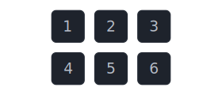

| Property | Type | Required | Description |
| --- | --- | --- | --- |
| `columns` | `i64` | yes | Number of equal-width columns; children flow across the rows. |
| `id` | `identifier` | no | Optional HTML id (also the edge-connection / anchor name). |
| `class` | `list<utf8>` | no | Extra CSS classes threaded onto the rendered element (and read for `background` / `color` / `border` overrides). |
| `disabled` | `bool` | no | When `true`, dims the control (renders at reduced opacity). |
| `x` | `f64` | no | Top-left x placement in the diagram (or use anchors). |
| `y` | `f64` | no | Top-left y placement in the diagram (or use anchors). |
| `width` | `f64` | no | Advisory box width (the widget is normally content-measured). |
| `height` | `f64` | no | Advisory box height (the widget is normally content-measured). |
| `anchor_left` | `f64` | no | Fractional anchor (0–1) pinning the left edge to the parent box. |
| `anchor_right` | `f64` | no | Fractional anchor (0–1) pinning the right edge to the parent box. |
| `anchor_top` | `f64` | no | Fractional anchor (0–1) pinning the top edge to the parent box. |
| `anchor_bottom` | `f64` | no | Fractional anchor (0–1) pinning the bottom edge to the parent box. |
| `connect_points` | `list<AnchorSide>` | no | Which sides (`:left`/`:right`/`:top`/`:bottom`) edges attach to. |
| `theme` | `symbol` | no | Per-element UI-theme override naming a `theme` block (falls back to the site's `ui_*` theme, then the document theme). |
| `accent` | `symbol` | no | Per-element accent hue override (falls back to the site / document theme). |
| `mode` | `symbol` | no | Per-element mode override: `:dark` or `:light` (falls back to the site / document theme). |

#### Child blocks

| Slot | Accepts | Multiple | Description |
| --- | --- | --- | --- |
| `children` | `Widget` | yes | Any `Widget`s, flowed across the grid. |

## Node graphs

A `wf_node_graph` mocks up a node editor — a shader graph, a blueprint, a dataflow pipeline. Each `wf_node` is a titled box with labelled `inputs` down its left edge and `outputs` down its right; a `wf_link` wires `"node.port"` → `"node.port"`. Nodes auto-lay-out left-to-right from the link graph (set `direction = :top_to_bottom` to flow downward, or give a node an explicit `x` / `y` to pin it).

```wcl
diagram {
  width = 560
  height = 240
  wf_node_graph {
    wf_node "Texture" {
      id = tex
      outputs = ["RGB", "Alpha"]
    }
    wf_node "Fresnel" {
      id = fres
      outputs = ["Factor"]
    }
    wf_node "Multiply" {
      id = mul
      inputs = ["A", "B"]
      outputs = ["Result"]
    }
    wf_node "Output" {
      id = out
      inputs = ["Color"]
    }
    wf_link "tex.RGB" {
      to = "mul.A"
    }
    wf_link "fres.Factor" {
      to = "mul.B"
    }
    wf_link "mul.Result" {
      to = "out.Color"
    }
  }
}
```

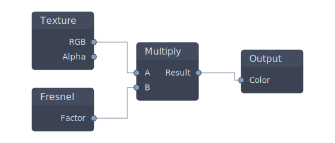

| Property | Type | Required | Description |
| --- | --- | --- | --- |
| `direction` | `symbol` | no | Layout flow: `:left_to_right` (default) or `:top_to_bottom`. |
| `id` | `identifier` | no | Optional HTML id (also the edge-connection / anchor name). |
| `class` | `list<utf8>` | no | Extra CSS classes threaded onto the rendered element (and read for `background` / `color` / `border` overrides). |
| `disabled` | `bool` | no | When `true`, dims the control (renders at reduced opacity). |
| `x` | `f64` | no | Top-left x placement in the diagram (or use anchors). |
| `y` | `f64` | no | Top-left y placement in the diagram (or use anchors). |
| `width` | `f64` | no | Advisory box width (the widget is normally content-measured). |
| `height` | `f64` | no | Advisory box height (the widget is normally content-measured). |
| `anchor_left` | `f64` | no | Fractional anchor (0–1) pinning the left edge to the parent box. |
| `anchor_right` | `f64` | no | Fractional anchor (0–1) pinning the right edge to the parent box. |
| `anchor_top` | `f64` | no | Fractional anchor (0–1) pinning the top edge to the parent box. |
| `anchor_bottom` | `f64` | no | Fractional anchor (0–1) pinning the bottom edge to the parent box. |
| `connect_points` | `list<AnchorSide>` | no | Which sides (`:left`/`:right`/`:top`/`:bottom`) edges attach to. |
| `theme` | `symbol` | no | Per-element UI-theme override naming a `theme` block (falls back to the site's `ui_*` theme, then the document theme). |
| `accent` | `symbol` | no | Per-element accent hue override (falls back to the site / document theme). |
| `mode` | `symbol` | no | Per-element mode override: `:dark` or `:light` (falls back to the site / document theme). |

#### Child blocks

| Slot | Accepts | Multiple | Description |
| --- | --- | --- | --- |
| `nodes` | `wf_node` | yes | The graph nodes (boxes with ports). |
| `links` | `wf_link` | yes | The links wiring node ports together. |

A titled node box with named `inputs` (left edge) and `outputs` (right edge) ports.

| Property | Type | Required | Description |
| --- | --- | --- | --- |
| `title` | `utf8` | yes | Node caption (the inline label). |
| `id` | `identifier` | no | Node id — the link-endpoint name (`from = "tex.RGB"`). |
| `inputs` | `list<utf8>` | no | Input port labels, listed down the left edge. |
| `outputs` | `list<utf8>` | no | Output port labels, listed down the right edge. |
| `x` | `f64` | no | Optional explicit x placement (pins the node; otherwise auto-laid-out). |
| `y` | `f64` | no | Optional explicit y placement (pins the node; otherwise auto-laid-out). |
| `class` | `list<utf8>` | no | Extra CSS classes (read for `background` / `color` / `border` overrides). |

Within a `wf_node_graph`, wires one node's port to another (`"node.port"` → `"node.port"`; a bare `"node"` targets its first port).

| Property | Type | Required | Description |
| --- | --- | --- | --- |
| `from` | `utf8` | yes | Source endpoint: `"node"` or `"node.port"` (an output port). |
| `to` | `utf8` | yes | Destination endpoint: `"node"` or `"node.port"` (an input port). |
| `label` | `utf8` | no | Optional caption drawn at the link's midpoint. |

## Controls

The leaf controls — text, buttons, fields, and toggles — drop into any container (or directly into a `diagram`).

### wf_label

A plain text label.

```wcl
diagram {
  width = 220
  height = 30
  wf_label "Just some label text."
}
```


| Property | Type | Required | Description |
| --- | --- | --- | --- |
| `text` | `utf8` | yes | The label text (the inline label). |
| `id` | `identifier` | no | Optional HTML id (also the edge-connection / anchor name). |
| `class` | `list<utf8>` | no | Extra CSS classes threaded onto the rendered element (and read for `background` / `color` / `border` overrides). |
| `disabled` | `bool` | no | When `true`, dims the control (renders at reduced opacity). |
| `x` | `f64` | no | Top-left x placement in the diagram (or use anchors). |
| `y` | `f64` | no | Top-left y placement in the diagram (or use anchors). |
| `width` | `f64` | no | Advisory box width (the widget is normally content-measured). |
| `height` | `f64` | no | Advisory box height (the widget is normally content-measured). |
| `anchor_left` | `f64` | no | Fractional anchor (0–1) pinning the left edge to the parent box. |
| `anchor_right` | `f64` | no | Fractional anchor (0–1) pinning the right edge to the parent box. |
| `anchor_top` | `f64` | no | Fractional anchor (0–1) pinning the top edge to the parent box. |
| `anchor_bottom` | `f64` | no | Fractional anchor (0–1) pinning the bottom edge to the parent box. |
| `connect_points` | `list<AnchorSide>` | no | Which sides (`:left`/`:right`/`:top`/`:bottom`) edges attach to. |
| `theme` | `symbol` | no | Per-element UI-theme override naming a `theme` block (falls back to the site's `ui_*` theme, then the document theme). |
| `accent` | `symbol` | no | Per-element accent hue override (falls back to the site / document theme). |
| `mode` | `symbol` | no | Per-element mode override: `:dark` or `:light` (falls back to the site / document theme). |

### wf_button

A button caption, with an optional leading `icon` (any `pack.name`); `disabled = true` greys it out.

```wcl
diagram {
  width = 320
  height = 50
  wf_row {
    wf_button "Save" {
      icon = "lucide.check"
    }
    wf_button "Cancel"
    wf_button "Delete" {
      disabled = true
    }
  }
}
```


| Property | Type | Required | Description |
| --- | --- | --- | --- |
| `text` | `utf8` | yes | Button caption (the inline label). |
| `icon` | `utf8` | no | Optional leading glyph as `pack.name`, e.g. `"lucide.check"`. |
| `id` | `identifier` | no | Optional HTML id (also the edge-connection / anchor name). |
| `class` | `list<utf8>` | no | Extra CSS classes threaded onto the rendered element (and read for `background` / `color` / `border` overrides). |
| `disabled` | `bool` | no | When `true`, dims the control (renders at reduced opacity). |
| `x` | `f64` | no | Top-left x placement in the diagram (or use anchors). |
| `y` | `f64` | no | Top-left y placement in the diagram (or use anchors). |
| `width` | `f64` | no | Advisory box width (the widget is normally content-measured). |
| `height` | `f64` | no | Advisory box height (the widget is normally content-measured). |
| `anchor_left` | `f64` | no | Fractional anchor (0–1) pinning the left edge to the parent box. |
| `anchor_right` | `f64` | no | Fractional anchor (0–1) pinning the right edge to the parent box. |
| `anchor_top` | `f64` | no | Fractional anchor (0–1) pinning the top edge to the parent box. |
| `anchor_bottom` | `f64` | no | Fractional anchor (0–1) pinning the bottom edge to the parent box. |
| `connect_points` | `list<AnchorSide>` | no | Which sides (`:left`/`:right`/`:top`/`:bottom`) edges attach to. |
| `theme` | `symbol` | no | Per-element UI-theme override naming a `theme` block (falls back to the site's `ui_*` theme, then the document theme). |
| `accent` | `symbol` | no | Per-element accent hue override (falls back to the site / document theme). |
| `mode` | `symbol` | no | Per-element mode override: `:dark` or `:light` (falls back to the site / document theme). |

### wf_input

A text field. With no `value` the `@inline` placeholder shows greyed; a `value` fills it with solid text.

```wcl
diagram {
  width = 240
  height = 90
  wf_column {
    wf_input "Search projects…"
    wf_input "Name" {
      value = "Ada Lovelace"
    }
  }
}
```

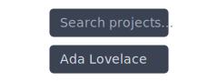

| Property | Type | Required | Description |
| --- | --- | --- | --- |
| `placeholder` | `utf8` | yes | Greyed prompt shown when empty (the inline label). |
| `value` | `utf8` | no | Filled value (renders solid, replacing the placeholder). |
| `id` | `identifier` | no | Optional HTML id (also the edge-connection / anchor name). |
| `class` | `list<utf8>` | no | Extra CSS classes threaded onto the rendered element (and read for `background` / `color` / `border` overrides). |
| `disabled` | `bool` | no | When `true`, dims the control (renders at reduced opacity). |
| `x` | `f64` | no | Top-left x placement in the diagram (or use anchors). |
| `y` | `f64` | no | Top-left y placement in the diagram (or use anchors). |
| `width` | `f64` | no | Advisory box width (the widget is normally content-measured). |
| `height` | `f64` | no | Advisory box height (the widget is normally content-measured). |
| `anchor_left` | `f64` | no | Fractional anchor (0–1) pinning the left edge to the parent box. |
| `anchor_right` | `f64` | no | Fractional anchor (0–1) pinning the right edge to the parent box. |
| `anchor_top` | `f64` | no | Fractional anchor (0–1) pinning the top edge to the parent box. |
| `anchor_bottom` | `f64` | no | Fractional anchor (0–1) pinning the bottom edge to the parent box. |
| `connect_points` | `list<AnchorSide>` | no | Which sides (`:left`/`:right`/`:top`/`:bottom`) edges attach to. |
| `theme` | `symbol` | no | Per-element UI-theme override naming a `theme` block (falls back to the site's `ui_*` theme, then the document theme). |
| `accent` | `symbol` | no | Per-element accent hue override (falls back to the site / document theme). |
| `mode` | `symbol` | no | Per-element mode override: `:dark` or `:light` (falls back to the site / document theme). |

### wf_dropdown

A select field showing the currently-chosen option label with a chevron.

```wcl
diagram {
  width = 200
  height = 44
  wf_dropdown "Release build"
}
```


| Property | Type | Required | Description |
| --- | --- | --- | --- |
| `text` | `utf8` | yes | The selected option label (the inline label). |
| `id` | `identifier` | no | Optional HTML id (also the edge-connection / anchor name). |
| `class` | `list<utf8>` | no | Extra CSS classes threaded onto the rendered element (and read for `background` / `color` / `border` overrides). |
| `disabled` | `bool` | no | When `true`, dims the control (renders at reduced opacity). |
| `x` | `f64` | no | Top-left x placement in the diagram (or use anchors). |
| `y` | `f64` | no | Top-left y placement in the diagram (or use anchors). |
| `width` | `f64` | no | Advisory box width (the widget is normally content-measured). |
| `height` | `f64` | no | Advisory box height (the widget is normally content-measured). |
| `anchor_left` | `f64` | no | Fractional anchor (0–1) pinning the left edge to the parent box. |
| `anchor_right` | `f64` | no | Fractional anchor (0–1) pinning the right edge to the parent box. |
| `anchor_top` | `f64` | no | Fractional anchor (0–1) pinning the top edge to the parent box. |
| `anchor_bottom` | `f64` | no | Fractional anchor (0–1) pinning the bottom edge to the parent box. |
| `connect_points` | `list<AnchorSide>` | no | Which sides (`:left`/`:right`/`:top`/`:bottom`) edges attach to. |
| `theme` | `symbol` | no | Per-element UI-theme override naming a `theme` block (falls back to the site's `ui_*` theme, then the document theme). |
| `accent` | `symbol` | no | Per-element accent hue override (falls back to the site / document theme). |
| `mode` | `symbol` | no | Per-element mode override: `:dark` or `:light` (falls back to the site / document theme). |

### wf_checkbox

An on/off checkbox; `checked = true` fills the box with a tick.

```wcl
diagram {
  width = 240
  height = 70
  wf_column {
    wf_checkbox "Enable telemetry" {
      checked = true
    }
    wf_checkbox "Join the beta"
  }
}
```


| Property | Type | Required | Description |
| --- | --- | --- | --- |
| `label` | `utf8` | yes | Checkbox caption (the inline label). |
| `checked` | `bool` | no | On/off state; `true` fills the box with a tick. |
| `id` | `identifier` | no | Optional HTML id (also the edge-connection / anchor name). |
| `class` | `list<utf8>` | no | Extra CSS classes threaded onto the rendered element (and read for `background` / `color` / `border` overrides). |
| `disabled` | `bool` | no | When `true`, dims the control (renders at reduced opacity). |
| `x` | `f64` | no | Top-left x placement in the diagram (or use anchors). |
| `y` | `f64` | no | Top-left y placement in the diagram (or use anchors). |
| `width` | `f64` | no | Advisory box width (the widget is normally content-measured). |
| `height` | `f64` | no | Advisory box height (the widget is normally content-measured). |
| `anchor_left` | `f64` | no | Fractional anchor (0–1) pinning the left edge to the parent box. |
| `anchor_right` | `f64` | no | Fractional anchor (0–1) pinning the right edge to the parent box. |
| `anchor_top` | `f64` | no | Fractional anchor (0–1) pinning the top edge to the parent box. |
| `anchor_bottom` | `f64` | no | Fractional anchor (0–1) pinning the bottom edge to the parent box. |
| `connect_points` | `list<AnchorSide>` | no | Which sides (`:left`/`:right`/`:top`/`:bottom`) edges attach to. |
| `theme` | `symbol` | no | Per-element UI-theme override naming a `theme` block (falls back to the site's `ui_*` theme, then the document theme). |
| `accent` | `symbol` | no | Per-element accent hue override (falls back to the site / document theme). |
| `mode` | `symbol` | no | Per-element mode override: `:dark` or `:light` (falls back to the site / document theme). |

### wf_radio

A radio button — like a checkbox but round; mark the active one with `selected = true` in a group you lay out yourself.

```wcl
diagram {
  width = 160
  height = 70
  wf_column {
    wf_radio "Dark" {
      selected = true
    }
    wf_radio "Light"
  }
}
```


| Property | Type | Required | Description |
| --- | --- | --- | --- |
| `label` | `utf8` | yes | Radio caption (the inline label). |
| `selected` | `bool` | no | Whether this option is chosen. |
| `id` | `identifier` | no | Optional HTML id (also the edge-connection / anchor name). |
| `class` | `list<utf8>` | no | Extra CSS classes threaded onto the rendered element (and read for `background` / `color` / `border` overrides). |
| `disabled` | `bool` | no | When `true`, dims the control (renders at reduced opacity). |
| `x` | `f64` | no | Top-left x placement in the diagram (or use anchors). |
| `y` | `f64` | no | Top-left y placement in the diagram (or use anchors). |
| `width` | `f64` | no | Advisory box width (the widget is normally content-measured). |
| `height` | `f64` | no | Advisory box height (the widget is normally content-measured). |
| `anchor_left` | `f64` | no | Fractional anchor (0–1) pinning the left edge to the parent box. |
| `anchor_right` | `f64` | no | Fractional anchor (0–1) pinning the right edge to the parent box. |
| `anchor_top` | `f64` | no | Fractional anchor (0–1) pinning the top edge to the parent box. |
| `anchor_bottom` | `f64` | no | Fractional anchor (0–1) pinning the bottom edge to the parent box. |
| `connect_points` | `list<AnchorSide>` | no | Which sides (`:left`/`:right`/`:top`/`:bottom`) edges attach to. |
| `theme` | `symbol` | no | Per-element UI-theme override naming a `theme` block (falls back to the site's `ui_*` theme, then the document theme). |
| `accent` | `symbol` | no | Per-element accent hue override (falls back to the site / document theme). |
| `mode` | `symbol` | no | Per-element mode override: `:dark` or `:light` (falls back to the site / document theme). |

### wf_toggle

A sliding on/off switch with an optional trailing label; `on = true` slides the knob across.

```wcl
diagram {
  width = 220
  height = 70
  wf_column {
    wf_toggle "Notifications" {
      on = true
    }
    wf_toggle "Do not disturb"
  }
}
```

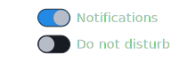

| Property | Type | Required | Description |
| --- | --- | --- | --- |
| `label` | `utf8` | no | Optional trailing caption (the inline label). |
| `on` | `bool` | no | Switch state; `true` slides the knob across. |
| `id` | `identifier` | no | Optional HTML id (also the edge-connection / anchor name). |
| `class` | `list<utf8>` | no | Extra CSS classes threaded onto the rendered element (and read for `background` / `color` / `border` overrides). |
| `disabled` | `bool` | no | When `true`, dims the control (renders at reduced opacity). |
| `x` | `f64` | no | Top-left x placement in the diagram (or use anchors). |
| `y` | `f64` | no | Top-left y placement in the diagram (or use anchors). |
| `width` | `f64` | no | Advisory box width (the widget is normally content-measured). |
| `height` | `f64` | no | Advisory box height (the widget is normally content-measured). |
| `anchor_left` | `f64` | no | Fractional anchor (0–1) pinning the left edge to the parent box. |
| `anchor_right` | `f64` | no | Fractional anchor (0–1) pinning the right edge to the parent box. |
| `anchor_top` | `f64` | no | Fractional anchor (0–1) pinning the top edge to the parent box. |
| `anchor_bottom` | `f64` | no | Fractional anchor (0–1) pinning the bottom edge to the parent box. |
| `connect_points` | `list<AnchorSide>` | no | Which sides (`:left`/`:right`/`:top`/`:bottom`) edges attach to. |
| `theme` | `symbol` | no | Per-element UI-theme override naming a `theme` block (falls back to the site's `ui_*` theme, then the document theme). |
| `accent` | `symbol` | no | Per-element accent hue override (falls back to the site / document theme). |
| `mode` | `symbol` | no | Per-element mode override: `:dark` or `:light` (falls back to the site / document theme). |

## Common fields

Every widget extends a shared `Widget` interface — its diagram placement geometry (`x` / `y` / anchors / `connect_points`) plus per-element theming hints:

| Property | Type | Required | Description |
| --- | --- | --- | --- |
| `id` | `identifier` | no | Optional HTML id (also the edge-connection / anchor name). |
| `class` | `list<utf8>` | no | Extra CSS classes threaded onto the rendered element (and read for `background` / `color` / `border` overrides). |
| `disabled` | `bool` | no | When `true`, dims the control (renders at reduced opacity). |
| `x` | `f64` | no | Top-left x placement in the diagram (or use anchors). |
| `y` | `f64` | no | Top-left y placement in the diagram (or use anchors). |
| `width` | `f64` | no | Advisory box width (the widget is normally content-measured). |
| `height` | `f64` | no | Advisory box height (the widget is normally content-measured). |
| `anchor_left` | `f64` | no | Fractional anchor (0–1) pinning the left edge to the parent box. |
| `anchor_right` | `f64` | no | Fractional anchor (0–1) pinning the right edge to the parent box. |
| `anchor_top` | `f64` | no | Fractional anchor (0–1) pinning the top edge to the parent box. |
| `anchor_bottom` | `f64` | no | Fractional anchor (0–1) pinning the bottom edge to the parent box. |
| `connect_points` | `list<AnchorSide>` | no | Which sides (`:left`/`:right`/`:top`/`:bottom`) edges attach to. |
| `theme` | `symbol` | no | Per-element UI-theme override naming a `theme` block (falls back to the site's `ui_*` theme, then the document theme). |
| `accent` | `symbol` | no | Per-element accent hue override (falls back to the site / document theme). |
| `mode` | `symbol` | no | Per-element mode override: `:dark` or `:light` (falls back to the site / document theme). |

## Custom widgets

Wireframe widgets are user-extensible diagram shapes. Declare a `@block("name") type … extends Widget` with a `lower` that returns `list<SvgFundamental>`, and it plugs into the diagram render path like any custom shape — placed directly in a `diagram` by its own `x` / `y` and connectable by edges. (The built-in containers only lay out the built-in widgets, so a custom widget renders as a standalone shape, not nested inside a `wf_window`.)

Here's a coloured status `wf_badge`. The `lower` reads its `x` / `y` and emits a filled box with a centred label — exactly how the built-in `process` shape lowers — and a `fill` field recolours an individual instance:

```wcl
diagram {
  width = 320
  height = 40
  wf_badge "passing" {
    x = 12.0
    y = 7.0
  }
  wf_badge "failing" {
    x = 130.0
    y = 7.0
    fill = "#c62828"
  }
}
```


```wcl
// Extends Widget → a diagram shape. The lower returns SVG fundamentals
// positioned at the widget's own x/y (like the built-in `process`), and a
// `fill` field recolours a single instance.
@block("wf_badge")
type WfBadge extends Widget {
  @inline(0) text: utf8
  fill = "#2e7d32"
  id: identifier?  class: list<utf8>?  disabled: bool?
  x = 0.0  y = 0.0  width = 96.0  height = 26.0
  anchor_left: f64?  anchor_right: f64?  anchor_top: f64?  anchor_bottom: f64?
  connect_points: list<AnchorSide>?
  theme: symbol?  accent: symbol?  mode: symbol?
  lower = fn(b: WfBadge) -> list<SvgFundamental> {
    [ SvgFundamental::Rect {
        x: b.x, y: b.y, width: b.width, height: b.height,
        fill: b.fill, class: b.class,
      },
      SvgFundamental::Label {
        content: b.text,
        x: b.x + b.width / 2.0,
        y: b.y + b.height / 2.0 + 4.0,
        fit_width: b.width, fit_height: b.height,
        fill: "#ffffff",
      } ]
  }
}

diagram { width = 320  height = 40
  wf_badge "passing" { x = 12.0  y = 7.0 }
  wf_badge "failing" { x = 130.0 y = 7.0  fill = "#c62828" }
}
```

## Related

- [terminal](../references/fact_terminals.md)

- [diagram](../references/fact_diagrams.md)

[← Back to SKILL.md](../SKILL.md)
